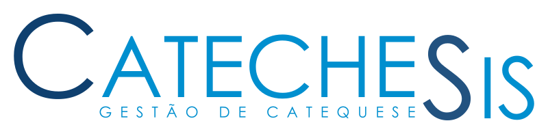

_**[PT] Software open-source para gestão de catequese, concebido por catequistas, para catequistas.**_

_**[EN] Open-source catechesis management software made by catechists for catechists.**_

-------
*See [English version](#english) below.*

# O que é o CatecheSis?

O CatecheSis é um sistema livre, *open-source*, concebido por catequistas e para catequistas para atender às necessidades da sua paróquia.

Faça a gestão da catequese paroquial online, de forma prática e simples, através de uma aplicação web.

Inclui recursos como:

- Inscrições / renovações de matrículas online;
- Gestão de grupos de catequese e catequistas;
- Arquivo do percurso catequético de catequizandos;
- Registo de sacramentos;
- Ferramenta de apoio à decisão para sacramentos;
- Análises estatísticas;
- Catequese virtual, onde os catequistas podem fazer publicações;

**Veja todos os recursos em [https://catechesis.org.pt](https://catechesis.org.pt).**

# Repositório de código

Este é o repositório dos manuais de utilizador.

Veja também o [repositório principal de código](https://github.com/CatecheSis-org-pt/catechesis).

-------

# What is CatecheSis?

CatecheSis is a free, *open-source* software designed by catechists and for catechists to meet the needs of your parish.

Manage parish catechesis online, in a practical and simple way, through a web application.

Includes features like:

- Online enrollment / enrollment renewals;
- Management of catechesis groups and catechists;
- Archive of the catechetical path of the catechumens;
- Registration of sacraments;
- Decision support tool for sacraments;
- Statistical analysis;
- Virtual catechesis, where catechists can make posts;

**See all resources at [https://catechesis.org.pt](https://catechesis.org.pt).**

 

**NOTE: CatecheSis is currently available only in Portuguese language.**

If you find this project useful and would be willing to help translating it to your mother language, contact us! We would appreciate your contribution! :)

Although the user interface is written in Portuguese, we are making efforts to guarantee that the source code and internal documentation are written in English, to facilitate the colaboration of developers from other countries.

# Source code repository

This is the users' manual repository.

See also [the main code repository](https://github.com/CatecheSis-org-pt/catechesis).

-------
Made with ❤️ by catechists and You!