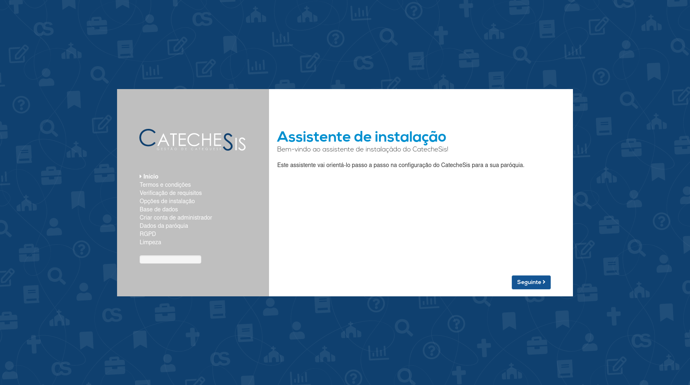
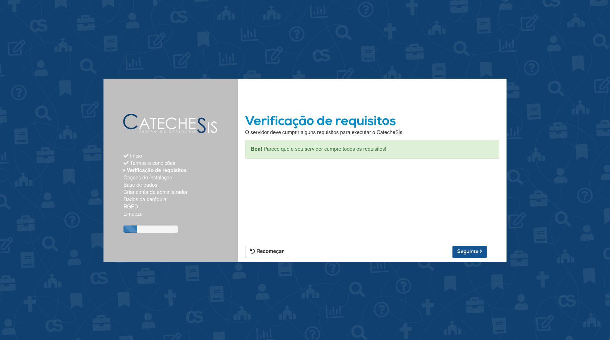
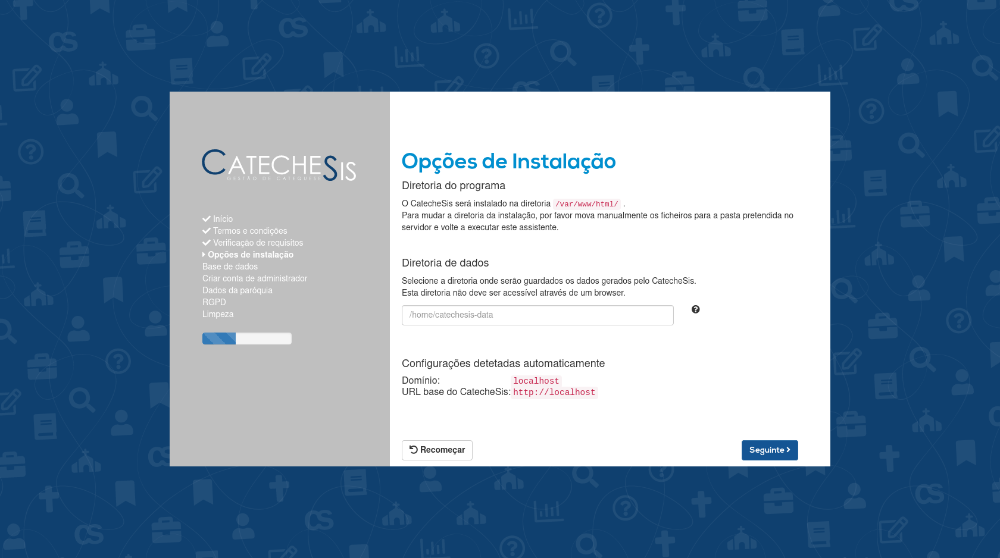
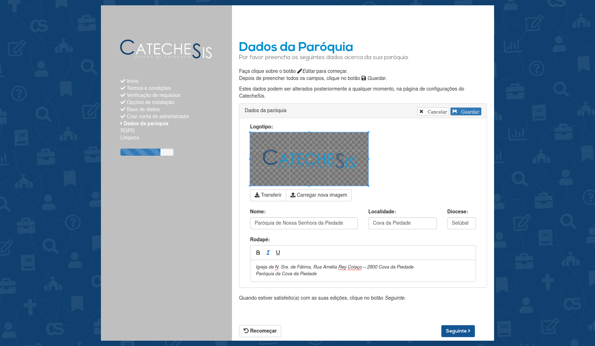
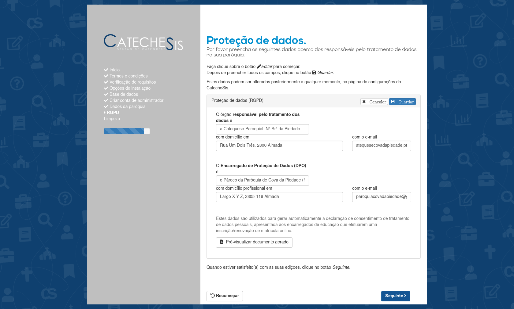
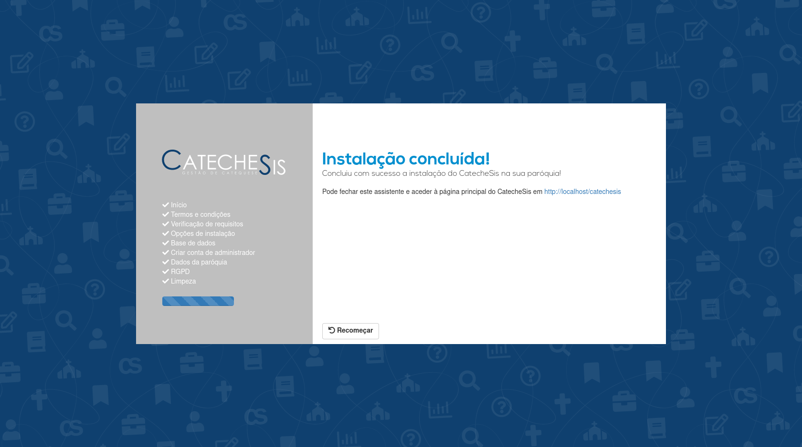

# Manual de Instalação

Este manual destina-se aos administradores / técnicos de informática responsáveis pela instalação do CatecheSis.

## 1. Requisitos

Antes de iniciar a instalação, certifque-se de que o seu servidor cumpre os seguintes requisitos:

- Servidor web Apache
- Servidor de base de dados MySQL 5.7 ou superior, ou MariaDB 10.3 ou superior
- PHP 7.4 ou superior
- Extensões PHP instaladas/ativas:
  - pdo_mysql
  - zip
  - gd
  - xml
  - XMLWriter
  - DOM
  - MBString
- Certificado SSL e servidor web configurado para HTTPS
- No mínimo, 200MB de espaço livre em disco

## 2. Instalar o CatecheSis num servidor web

### 2.1 Decarregar o CatecheSis

Visite a página [https://catechesis.org.pt](https://catechesis.org.pt) e navegue até à secção *Transferir* para descarregar um ficheiro compactado contendo o CatecheSis.

O ficheiro tem um nome da forma `CatecheSis-vX.Y.Z.tar.gz` onde *X.Y.Z* designa a versão (por exemplo, `CatecheSis-v2.0.0.tar.gz`).

### 2.2 Instalar o CatecheSis

#### 2.2.1 Preparativos

1. Carregue no seu servidor web, na diretoria pública principal (geralmente `public_html` ou `/var/www`) ou numa subdiretoria daquela,  o ficheiro `CatecheSis-vX.Y.Z.tar.gz` que descarregou do site oficial e descomprima-o.

2. Certifique-se de que o utilizador do sistema que executa o processo do Apache/PHP tem permissões de escrita na diretoria que acaba de descompactar e em todas as suas subdiretorias e ficheiros.

3. Crie uma nova base de dados MySQL vazia, para uso do CatecheSis (por exemplo, chamada `catechesis`).

#### 2.2.2 Instalar utilizando o assistente de instalação

1. Inicie um navegador *web* e aceda ao endereço `https://<URL_do_CatecheSis>/setup`, onde `<URL_do_CatecheSis>` designa o endereço onde ficará disponível o CatecheSis (por exemplo: *example.com/catechesis*).

    Deverá ser mostrada a seguinte página:
    

2. Faça clique em *Seguinte*.

3. Por favor leia os termos e condições apresentados na página. Se concordar, marque a opção _**Li e aceito os termos e condições**_ e de seguida clique em *Seguinte*.

4. O assistente de instalação vai agora verificar se o seu servidor cumpre os requisitos técnicos para executar o CatecheSis.
    
   Se forem detetados problemas, será exibida uma caixa vermelha. Por favor instale os pacotes de software que estão em falta, e que são indicados nessa caixa, e volte ao passo 1.

    

      
<b>NOTA:</b> 
      Por razões de segurança, o assistente de instalação <i>exige</i> que o servidor esteja configurado para utilizar HTTPS. 
      Se o seu servidor não tem um certificado SSL configurado, por favor crie um ou contacte o seu provedor de alojamento web e informe-se sobre como pode obter um. 
      

    

   Se não forem detetados problemas, surgirá uma caixa verde. Clique em *Seguinte* para continuar.
   

5. Escolha uma diretoria no seu servidor para armazenar os dados gerados pelo CatecheSis, tais como documentos carregados e fotografias, e escreva-a na caixa.
   
   Esta diretoria *não* deverá existir ainda no seu servidor, pois será criada pelo assistente.
   
   **Certifique-se de que esta diretoria não é servida pelo seu servidor web**, isto é, que não é acessível publicamente através de um browser.
   
   Clique em *Seguinte*.

6. Preencha as credenciais de acesso à base de dados que criou previamente.
   
   Se a sua base de dados residir fisicamente na mesma máquina que o servidor web, escreva *localhost* na caixa *Servidor:*. Esta é a situação mais comum em serviços de alojamento web.

   Clique em *Seguinte*.

   A base de dados será preenchida com as tabelas necessárias para o CatecheSis. Se ocorrer algum erro durante este processo, voltará a ver esta página e informações sobre o erro. Caso contrário, será encaminhado para a página seguinte.

7. É altura de criar uma conta de admninistrador.

   Preencha o nome da pessoa em questão, escolha um nome de utilizador para a identificar no sistema e uma palavra-passe.

   A palavra-passe deve ter, no mínimo, 10 caracteres, contendo letras, dígitos e símbolos especiais.
   
   
   
   

      
<b>NOTA:</b> 
      Esta é uma boa ocasião para criar uma conta de administrador para o seu pároco. 
      

    

   

      
<b>NOTA:</b> 
      Poderá criar outras contas de admnistrador mais tarde, no CatecheSis. 
      

    

8. Preencha os dados da sua paróquia, no painel mostrado.

   Para começar o preenchimento, clique no botão *Editar* no canto superior direito do painel.

   Quando terminar de preencher todos os campos, clique no botão *Guardar* no canto superior direito do painel.

   

   Quando estiver satisfeito com as alterações, clique em *Seguinte*.

   

      
<b>NOTA:</b> 
      Deve clicar no botão <i>Guardar</i>, no canto superior direito do painel, antes de avançar com o botão <i>Seguinte</i>, para que as alterações fiquem guardadas.
      

   

   

      
<b>NOTA:</b> 
      Poderá aceder a este mesmo painel mais tarde, e efetuar alterações aos dados da paróquia, na página de configurações do CatecheSis.
      

   

9. Preencha as informações relativas à proteção de dados.

   Para garantir o cumprimento do Regulanento Geral de Proteção de Dados (RGPD) na sua paróquia, por favor preencha o nome e contacto das pessoas responsáveis.

   Para começar o preenchimento, clique no botão *Editar* no canto superior direito do painel.

   Quando terminar de preencher todos os campos, clique no botão *Guardar* no canto superior direito do painel.

   

   Quando estiver satisfeito com as alterações, clique em *Seguinte*.

   

      
<b>NOTA:</b> 
      Deve clicar no botão <i>Guardar</i>, no canto superior direito do painel, antes de avançar com o botão <i>Seguinte</i>, para que as alterações fiquem guardadas.
      

   

   

      
<b>NOTA:</b> 
      Poderá aceder a este mesmo painel mais tarde, e efetuar alterações, na página de configurações do CatecheSis.
      

   

   

10. A última página do assistente informá-lo-á se a instalção foi concluída com sucesso.

   
   
   Poderá ser necessário remover manualmente a pasta `setup`, se o assistente não encontrar as permissões necessárias para o fazer automaticamente.

   

      
<b>NOTA:</b> 
      <b>Por razões de segurança, é muito importante garantir que a pasta <code>setup</code> é eliminada após a conclusão do assistente de instalação.</b>
      Se a pasta não foi eliminada automaticamente, por favor elimine-a manualmente no seu servidor.
      

   

Continue para [Configurações adicionais](#configuracoes-adicionais)

#### 2.2.3 Instalar manualmente [para utilizadores avançados]

É possível instalar e configurar o CatecheSis sem utilizar o assistente de instalação.
Para tal, os passos genéricos são estes:

1. Crie uma base se dados MySQL.

2. Execute, por esta ordem, os scripts SQL `catechesis_database.sql` e `ulogin_database.sql` localizados na diretoria `setup`.

3. [OPCIONAL] Para uma segurança reforçada, pode criar utilizadores da base de dados específicos para cada contexto de segurança. Para tal, preencha as respetivas palavras-passe no ficheiro `users.sql` e execute esse script.

4. Crie uma pasta no seu servidor, numa localização que não seja servida pelo servidor web (i.e. que não fique acessivel publicamente através de um navegador), para alojar o conteúdo gerado pelo CatecheSis.

   Por exemplo, crie a pasta `catechesis_data` na raíz do seu servidor.

   Depois, copie para essa pasta o conteúdo da pasta `setup/catechesis_data`.

5. Crie uma cópia do ficheiro `core/config/catechesis_config.inc.template.php` e renomeie-a para `catechesis_config.inc.php`.
   
   Depois, substitua todos os campos nesse ficheiro pelos valores apropriados, nomeadamente:

   | Campo                     | Descrição                                                                                        |
   |--------------------------------------------------------------------------------------------------|--------------------------------------------------------------------------------------------------|
   | CATECHESIS_DOMAIN         | O seu domínio na internet (ex: *example.com*).                                                   |
   | CATECHESIS_BASE_URL       | A URL da página principal do CatecheSis (ex: *https://example.com/catechesis*)                   |
   | CATECHESIS_ROOT_DIRECTORY | O caminho para a diretoria principal do CatecheSis, no seu servidor. (ex: */var/www/catechesis*) |
   | CATECHESIS_DATA_DIRECTORY | O caminho para a diretoria de dados que criou no passo 4. (ex: */home/catechesis_data*)          |

6. Crie uma cópia do ficheiro `<catechesis_data>/config/catechesis_config.shadow.template.php` e renomeie-a para `catechesis_config.shadow.php`. Note que `<catechesis_data>` no caminho anterior refere-se à pasta que criou no passo 4.

   Depois, substitua todos os campos nesse ficheiro pelos valores apropriados, nomeadamente:

   | Campo                   | Descrição                                                                                                                                                                                             |
   |-------------------------|-------------------------------------------------------------------------------------------------------------------------------------------------------------------------------------------------------|
   | CATECHESIS_UL_SITE_KEY  | Crie uma chave criptográfica alfanumérica com 40 ou mais caracteres e escreva-a aqui.                                                                                                                 |
   | CATECHESIS_HOST         | Nome do servidor que aloja a base de dados (ex: *localhost*)                                                                                                                                          |
   | CATECHESIS_DB           | Nome da base de dados que criou no passo 1.                                                                                                                                                           |
   | HIGH_SECURITY           | Se executou o passo opcional 3., para uma segurança reforçada, escreva `true`no valor desta variável e preencha as palavras-passe dos utilizadores da base de dados em cada um dos campos `<PASS...>` |
   | DB_ROOT_USER            | Nome de utilizador único para acesso à base de dados (no caso de não ter executado o passo 3.).                                                                                                       |
   | DB_ROOT_PASSWORD        | Palavra-passe do utilizador único para acesso à base de dados (no caso de não ter executado o passo 3.).                                                                                              |

7. Modifique no ficheiro `setup/criaAdmin.php` o nome e as credenciais desejadas para criar uma conta de administrador para o CatecheSis.

   Depois, execute esse script acedendo através de um navegador à página `https://<O_SEU_DOMINIO/catechesis>/setup/criaAdmin.php`.

8. **Elimine a pasta `setup`.**

9. Aceda ao CatecheSis através de um navegador, entre com a conta de administrador criada no passo 7., e termine a configuração dos dados da paróqua e do Regulamento Geral de Proteção de Dados na página de configurações do CatecheSis.

### 2.3 Configurações adicionais

Existem alguns passos adicionais que têm de ser executados manualmente, para concluir a instalação do CatecheSis.

1. Confirme, utilizando um navegador web, que o conteúdo das pastas internas do CatecheSis (nomeadamente `core`) não está a ser servido. 

   Esta verificação destina-se a testar se o seu servidor está corretamente configurado para interpretar as diretrizes dos ficheiros `.htaccess` que bloqueiam o acesso dos visitantes a determinadas áreas internas do CatecheSis.
   Se necessário, corrija a configuração do servidor web.

2. Para que a funcionalidade de estatísticas de catequizandos residentes na paróquia funcione, é necessário preencher tabela `cod_postais_paroquia` da base de dados com os códigos postais abrangidos pela sua paróquia.

## 3. Instalar a Catequese Cloud [OPCIONAL]

A Catequese Cloud é um componente opcional. Trata-se de uma plataforma de partilha de ficheiros (vulgarmente chamada de "cloud"), baseada no software open-source [NextCloud](https://nextcloud.com/).
O CatecheSis possui integrações específicas com a Nextcloud, de forma a que possa utilizar as mesmas contas de utilizador para aceder a ambos os sistemas, e para que possa facilmente utilizar recursos da nuvem nas sessões de catequese virtual.

Atualmente, a documentação de configuração da Catequese Cloud e respetiva integração com o CatecheSis encontra-se apenas disponível em língua inglesa, no [repositório de código do CatecheSis](https://github.com/CatecheSis-org-pt/catechesis/blob/master/integrations/Nextcloud/CatecheSis%20Nextcloud%20integration.md).

## 4. Manter o CatecheSis atualizado

O CatecheSis irá apresentar uma notificação quando estiver disponível uma nova versão para transferir, e inclui um
Assistente de Atualização que transfere e instala automaticamente atualizações, quando estas estiverem disponíveis.

Para mais informações sobre o processo de atualização, consulte a secção
*[Manter o CatecheSis atualizado](manual_do_utilizador.md#220-manter-o-catechesis-atualizado-)* no [Manual do Utilizador](./manual_do_utilizador.md).

