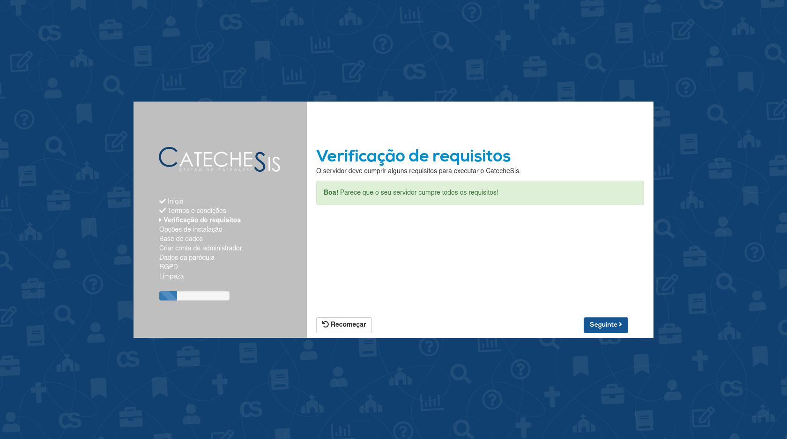
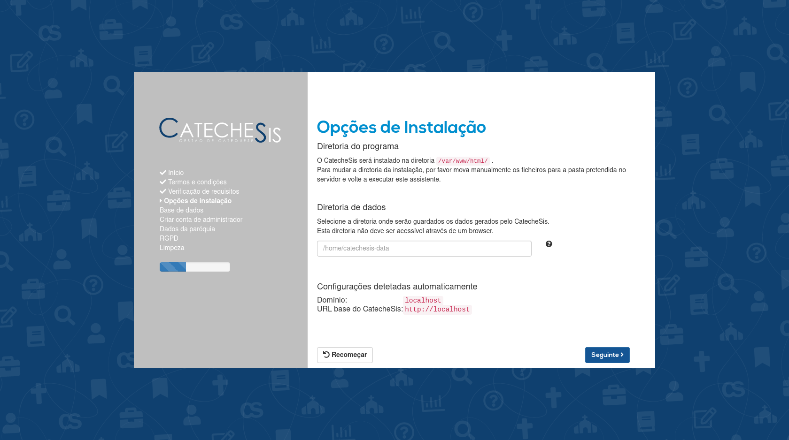
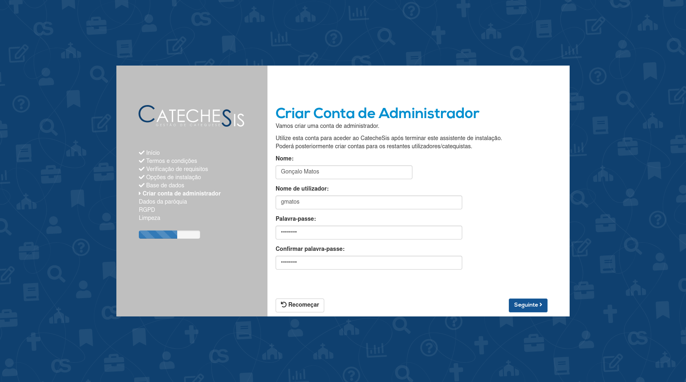

# Instalação

Este manual destina-se aos administradores / técnicos de informática responsáveis pela instalação do CatecheSis.

## Requisitos

## Instalar o CatecheSis num servidor web

### Decarregar o CatecheSis

### Instalar o CatecheSis

#### Preparativos

#### Instalar utilizando o assistente de instalação

1. Inicie um navegador *web* e aceda ao endereço `https://<URL_do_CatecheSis>/setup`, onde `<URL_do_CatecheSis>` designa o endereço onde ficará disponível o CatecheSis (por exemplo: *aminhaparoquia.pt/catechesis*).

    Deverá ser mostrada a seguinte página:
    

2. Faça clique em *Seguinte*.

3. Por favor leia os termos e condições apresentados na página. Se concordar, marque a opção _**Li e aceito os termos e condições**_ e de seguida clique em *Seguinte*.

4. O assistente de instalação vai agora verificar se o seu servidor cumpre os requisitos técnicos para executar o CatecheSis.
    
   Se forem detetados problemas, será exibida uma caixa vermelha. Por favor instale os pacotes de software que estão em falta, e que são indicados nessa caixa, e volte ao passo 1.

    

      
<b>NOTA:</b> 
      Por razões de segurança, o assistente de instalação <i>exige</i> que o servidor esteja configurado para utilizar HTTPS. 
      Se o seu servidor não tem um certificado SSL configurado, por favor crie um ou contacte o seu provedor de alojamento web e informe-se sobre como pode obter um. 
      

    

   Se não forem detetados problemas, surgirá uma caixa verde. Clique em *Seguinte* para continuar.
   

5. Escolha uma diretoria no seu servidor para armazenar os dados gerados pelo CatecheSis, tais como documentos carregados e fotografias, e escreva-a na caixa.
   
   Esta diretoria *não* deverá existir ainda no seu servidor, pois será criada pelo assistente.
   
   **Certifique-se de que esta diretoria não é servida pelo seu servidor web**, isto é, que não é acessível publicamente através de um browser.
   
   Clique em *Seguinte*.

6. Preencha as credenciais de acesso à base de dados que criou previamente.
   
   Se a sua base de dados residir fisicamente na mesma máquina que o servidor web, escreva *localhost* na caixa *Servidor:*. Esta é a situação mais comum em serviços de alojamento web.

   Clique em *Seguinte*.

   A base de dados será preenchida com as tabelas necessárias para o CatecheSis. Se ocorrer algum erro durante este processo, voltará a ver esta página e informações sobre o erro. Caso contrário, será encaminhado para a página seguinte.

7. É altura de criar uma conta de admninistrador.

   Preencha o nome da pessoa em questão, escolha um nome de utilizador para a identificar no sistema e uma palavra-passe.

   A palavra-passe deve ter, no mínimo, 10 caracteres, contendo letras, dígitos e símbolos especiais.
   
   
   
   

      
<b>NOTA:</b> 
      Esta é uma boa ocasião para criar uma conta de administrador para o seu pároco. 
      

    

   

      
<b>NOTA:</b> 
      Poderá criar outras contas de admnistrador mais tarde, no CatecheSis. 
      

    

8. Preencha os dados da sua paróquia, no painel mostrado.

   Para começar o preenchimento, clique no botão *Editar* no canto superior direito do painel.

   Quando terminar de preencher todos os campos, clique no botão *Guardar* no canto superior diretio do painel.

   **TODO Screenshot**

   Quando estiver satisfeito com as alterações, clique em *Seguinte*.

   

      
<b>NOTA:</b> 
      Deve clicar no botão <i>Guardar</i>, no canto superior direito do painel, antes de avançar com o botão <i>Seguinte</i>, para que as alterações fiquem guardadas.
      

   

   

      
<b>NOTA:</b> 
      Poderá aceder a este mesmo painel mais tarde, e efetuar alterações aos dados da paróquia, na página de configurações do CatecheSis.
      

   

9. Preencha as informações relativas à proteção de dados.

   Para garantir o cumprimento do Regulanento Geral de Proteção de Dados (RGPD) na sua paróquia, por favor preencha o nome e contacto das pessoas responsáveis.

   Para começar o preenchimento, clique no botão *Editar* no canto superior direito do painel.

   Quando terminar de preencher todos os campos, clique no botão *Guardar* no canto superior diretio do painel.

   **TODO Screenshot**

   Quando estiver satisfeito com as alterações, clique em *Seguinte*.

   

      
<b>NOTA:</b> 
      Deve clicar no botão <i>Guardar</i>, no canto superior direito do painel, antes de avançar com o botão <i>Seguinte</i>, para que as alterações fiquem guardadas.
      

   

   

      
<b>NOTA:</b> 
      Poderá aceder a este mesmo painel mais tarde, e efetuar alterações, na página de configurações do CatecheSis.
      

   

   

10. A última página do assistente informá-lo-á se a instalção foi concluída com sucesso.

    Poderá ser necessário remover manualmente a pasta `setup`, se o assistente não encontrar as permissões necessárias para o fazer automaticamente.

   

      
<b>NOTA:</b> 
      <b>Por razões de segurança, é muito importante garantir que a pasta <code>setup</code> é eliminada após a conclusão do assistente de instalação.</b>
      Se a pasta não foi eliminada automaticamente, por favor elimine-a manualmente no seu servidor.
      

   

#### Instalar manualmente [para utilizadores avançados]

### Configurações adicionais

## Manter o CatecheSis atualizado
