# Manual do Utilizador

Este manual destina-se a todos os utilizadores do CatecheSis.

## 1. Conceitos básicos

### 1.1 Utilizar os menus

A interface do CatecheSis apresenta permanentemente, no topo, uma barra de menus. Utilize os menus para efectuar tarefas e aceder às diversas funcionalidades do CatecheSis.

A sua localização atual está assinalada com uma tonalidade diferente.

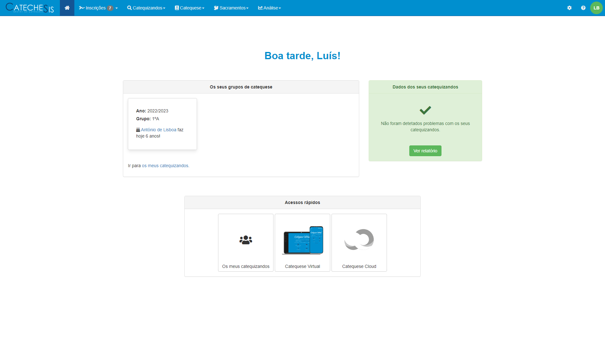

<i> - Página Principal do CatecheSis - </i>

No canto superior direito é apresentada a imagem de perfil do utilizador autenticado (por omissão, um círculo com as suas iniciais). Clicando sobre esta é apresentada a opção _Terminar sessão_. 

  
<b>NOTA:</b> 
    Utilize sempre o botão <i>Terminar sessão</i> para terminar a sua sessão e sair do CatecheSis em segurança. 
  

Ainda no canto superior direito, estão localizados mais dois _icons_: o botão de configurções do CatecheSis, e o botão de ajuda, que dá acesso ao Manual de Utilizador e alguma informação sobre o CatecheSis.

Ao centro da página é apresentada alguma informação util ao catequista:

- **Os seus grupos de catequese**: São apresentados os vários grupos de catequese assim como aniversários dentro desse mesmo grupo de Catequese. Existe ainda a possibilidade de ir para _os meus catequizandos_, de forma rápida.
- **Dados dos seus catequizandos**: Indica de forma visual se as fichas dos seus catequizandos contêm alguma informação incompleta ou incorreta. A cor da _caixa_ varia consoante a gravidade inconsistência de dados. Selecionando a opção _Ver relatório_ é apresentado o relatório completo dos dados inconsistentes dos seus catequizandos (por exemplo, números de telefone inválidos, datas de baptismo inválidas, ou comprovativos de baptismo em falta). _Veja também [2.9.4 Listar catequizandos com dados inconsistentes](#listar-catequizandos-com-dados-inconsistentes)_.
- **Acessos rápidos**: São apresentados os vários alguns acessos rápidos, úteis para o catequista. 

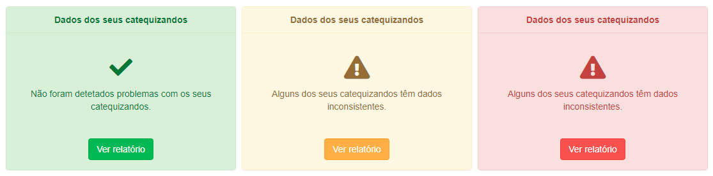

<i> - Opções relativamente a inconsistência de dados dos catequizandos - </i>

  
<b>NOTA:</b> 
  Dependendo do seu tipo de conta de utilizador ou do contexto em que se encontra, algumas opções do menu poderão não estar visíveis ou não serem selecionáveis. Consulte <b>Tipos de contas</b> neste manual.
  

### 1.2 Tipos de contas

Existem vários tipos de contas de utilizador no CatecheSis.

Relativamente ao sistema, o seu tipo de conta pode ser:

- **Utilizador (simples)** – É o tipo de conta mais comum. Tem permissões para modificar os seus próprios dados pessoais e aceder somente às fichas dos seus catequizandos (se for catequista), para leitura e edição. Permite ainda fazer pesquisas sobre a base de dados de catequizandos, imprimir a folha de presenças e as fichas do grupo em que dá catequese, e consultar as estatísticas da catequese paroquial.
- **Administrador** – Além de tudo o que um utilizador simples pode fazer, um Administrador pode ainda inscrever catequizandos, aceder à ficha de qualquer catequizando e modificar fichas, gerar e imprimir listagens de catequizandos (ex: baptismos, escuteiros, etc.), criar e gerir grupos de catequese, criar e modificar contas de outros utilizadores.

Relativamente à catequese, o seu tipo de conta pode ser:

- **Catequista ativo** – Pode ser inserido num grupo de catequese no ano catequético atual.
- **Catequista inativo** – Não pode ser inserido num grupo de catequese no ano catequético atual, mas já deu catequese no passado e/ou poderá vir a tornar-se um catequista ativo no futuro.
- **Não catequista** – Nunca pode ser inserido numa grupo de catequese. Este tipo de conta pode ser utilizada por um utilizador que apenas efectue tarefas administrativas, por exemplo.

Apenas um Administrador pode modificar o tipo de conta dos utilizadores.

Algumas funcionalidades do CatecheSis só estão disponíveis para Administradores. De ora em diante neste manual, essas funcionalidades serão assinaladas com o ícone .

#### 1.2.1 Qual é o meu tipo de conta?

Para saber qual o seu tipo de conta, aceda ao ecrã _Configurações_ (ícone da roda dentada no canto superior direito do ecrã).

No painel _Dados da conta_ observe o campo _Atributos_.

Se não possuir o atributo _Administrador_, o seu tipo de conta é de _Utilizador (simples)_. Se não tiver o atributo _Catequista ativo_ nem _Catequista inativo_, então não é catequista.

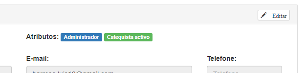

<i> - Utilizador tem uma conta de Administrador e é um catequista ativo - </i>

### 1.3 Editar dados no Catechesis

Em diversos ecrãs do CatecheSis é possível editar dados.

Sempre que tal for possível, encontrará um botão _Editar_, geralmente localizado no canto superior direito dos painéis. Clique em _Editar_ para habilitar o modo de edição.

Nesse momento, o botão _Editar_ será substituído por dois botões: _Cancelar_ e _Guardar_. Clique em _Guardar_ para submeter as alterações à base de dados, ou em _Cancelar_ para descartar as alterações.

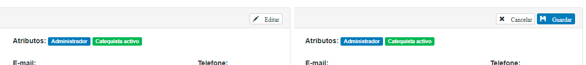

<i> - Botão de Editar e botões de Cancelar e Guardar. - </i>

Depois de submeter as alterações procure uma caixa de diálogo, geralmente localizada no topo do ecrã, que confirma se a operação foi completada com sucesso (caixa verde) ou se ocorreu um erro (caixa vermelha).

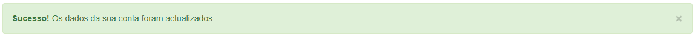

<i> - Modificação dos dados da minha conta - </i>

## 2. Efectuar uma tarefa

### 2.1 Modificar os dados da minha conta

Aceda aceda ao ecrã _Configurações_ (ícone da roda dentada no canto superior direito do ecrã), localize o painel _Dados da conta_ e clique no botão _Editar_, localizado no canto superior direito do painel.

Pode modificar a forma como o seu nome é apresentado no programa, o seu endereço de _e-mail_ e o seu número de telefone.

Para modificar também a palavra-passe, clique na linha _Modificar palavra-passe_.

Não é possível modificar o seu nome de utilizador. Os atributos da sua conta só podem ser modificados por um administrador.

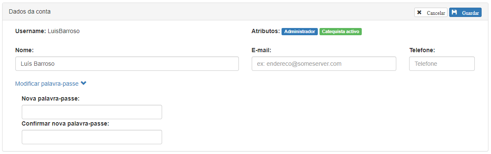

<i> - O Utilizador editou os dados da sua conta com sucesso - </i>

Quando estiver satisfeito(a) com as alterações, clique em _Guardar_.

  
<b>NOTA 1:</b> 
  O seu endereço de <i>e-mail</i> e o seu número de telefone são visíveis apenas por administradores, e destinam-se a permitir que estes entrem em contacto consigo se necessário.
  

<b>NOTA 2:</b> 
  O seu nome, tal como escrito na caixa <i>Nome</i>, é utilizado em determinados ecrãs do CatecheSis e é o que poderá ser visto pelos outros utilizadores.
  Em alguns ecrãs, bem como no canto superior direito do ecrã, o CatecheSis apresenta apenas o seu primeiro e último nome. O seu primeiro e último nome correspondem à primeira e última palavra escritas na caixa <i>Nome</i>, respectivamente.
  

### 2.2 Consultar as fichas dos meus catequizandos

#### 2.2.1 Opção 1

Aceda ao ecrã de _Início_ (clicando no ícone da casa, ou no logotipo do CatecheSis, na barra de menu) e observe o painel _Os seus grupos de catequese_. É apresentado o(s) seu(s) grupo(s) de catequese neste ano catequético.

<i> - Painel sobre Os seus grupos de catequese - </i>

  
<b>NOTA:</b> 
  Neste ecrã também pode ficar a saber se algum dos seus catequizandos faz anos hoje!
  

Clique em _Ir para os meus catequizandos_.

#### 2.2.2 Opção 2

Aceda ao menu _Catequizandos_ e clique em _Os meus catequizandos._

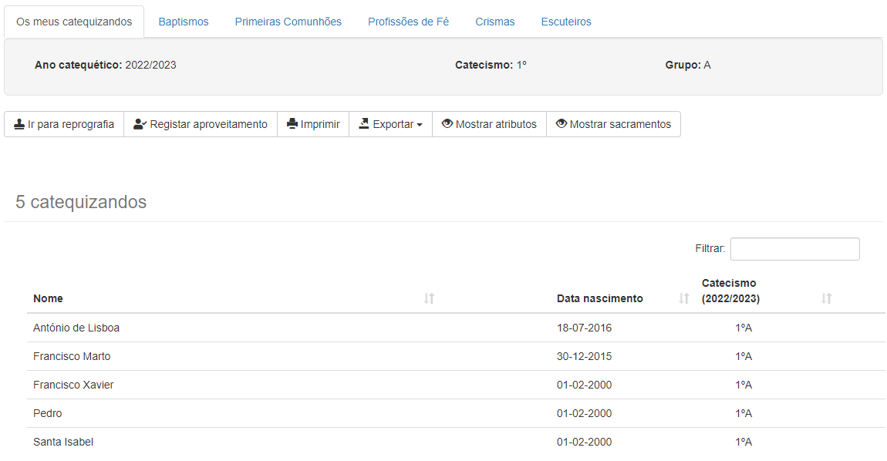

<i> - Listagem dos catequizandos - </i>

Clique sobre o nome de um catequizando para abrir a respectiva ficha.

### 2.3 Procurar e consultar a ficha de um catequizando

#### 2.3.1 Procurar por nome / data de nascimento

Aceda ao menu _Catequizandos_ e selecione a opção _Por nome / data de nascimento_.

No campo _Nome_ pode escrever o nome completo ou apenas parte dele. Pode até escrever qualquer subconjunto de caracteres do nome separados por espaços, desde que estejam ordenados tal como surgem no nome do catequizando. Experimente, por exemplo, escrever apenas as iniciais do nome, separadas por espaços.

A pesquisa não é sensível a maiúsculas/minúsculas, nem a acentos ou cedilhas.

No campo _Nasceu a_ pode especificar a data de nascimento clicando com o rato na caixa ou utilizando teclado (no formado _dd-mm-aaaa_).

Ambos os campos são opcionais.

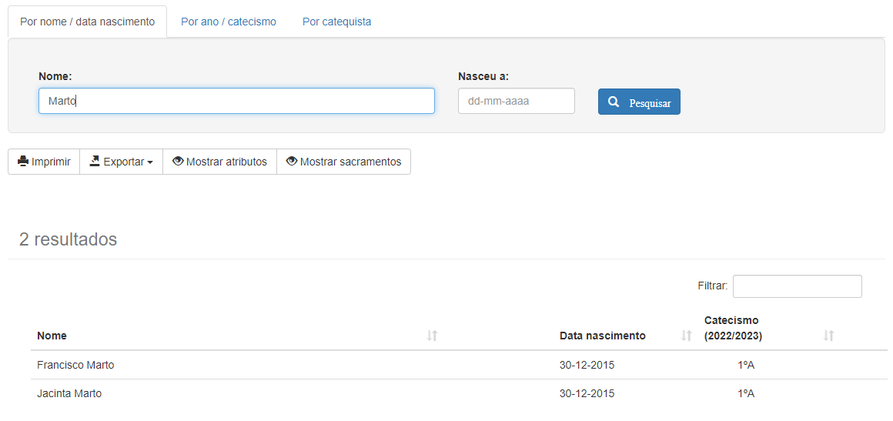

<i> - Procurar por nome / data de nascimento - </i>

Clique sobre o nome de qualquer catequizando na lista de resultados para aceder à respectiva ficha.

  
<b>NOTA:</b> 
  Se a sua conta for do tipo <i>Administrador</i> poderá abrir a ficha de qualquer catequizando.  
  Caso contrário, só poderá abrir as fichas dos catequizandos que pertençam ao seu grupo de catequese neste ano catequético.
  

#### 2.3.2 Procurar por ano / catecismo

Aceda ao menu _Catequizandos_ e selecione a opção _Por ano / catecismo_.

Pode atribuir valores aos campos _Ano catequético_, _Catecismo_ e _grupo_. Todos eles são opcionais.

É possível também filtrar os resultados obtidos segundo determinados critérios. Para tal, clique na linha _Aplicar filtros_ e surgirão mais opções.

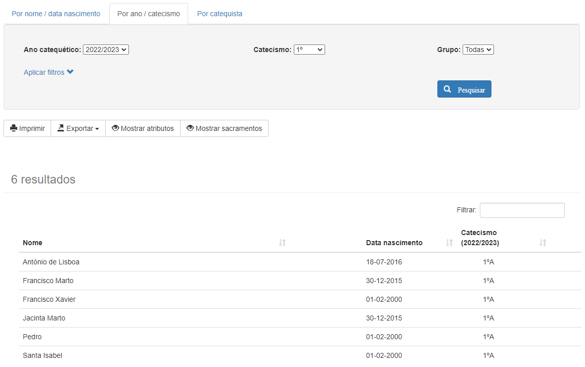

<i> - O Utilizador pediu todos os catequizandos inscritos no 1ºAno em 
2022/2023 - </i>

  
<b>NOTA 1:</b>
  Depois de clicar em <i>Pesquisar,</i> os resultados desta pesquisa (incluindo os filtros que aplicou) podem ser impressos ou exportados como um ficheiro do Microsoft Excel ou PDF. Para tal, utilize os botões <i>Imprimir</i> e <i>Exportar</i>, respectivamente, localizados imediatamente antes da lista de resultados.
  

  
<b>NOTA 2:</b>
  Se especificar valores para os três campos <i>Ano catequético</i>, <i>catecismo</i> e <i>grupo</i>, surgirá juntamente com os resultados da pesquisa um botão que permite imprimir a folha de presenças para esse grupo de catequese bem como as fichas dos catequizandos.
  

  
<b>NOTA 3:</b>
  Se a sua conta for do tipo <i>Administrador</i> poderá abrir a ficha de qualquer catequizando.
  Caso contrário, só poderá abrir as fichas dos catequizandos que pertençam ao seu grupo de catequese neste ano catequético.
  

#### 2.3.3 Procurar por catequista

Aceda ao menu _Catequizandos_ e selecione a opção _Por catequista_.

Pode atribuir valores aos campos _Ano catequético_ e _Catequista_. Ambos são opcionais.

É possível também filtrar os resultados obtidos segundo determinados critérios. Para tal, clique na linha _Aplicar filtros_ e surgirão mais opções. Consulte o exemplo no tópico anterior.

  
<b>NOTA 1:</b>
  Depois de clicar em <i>Pesquisar,</i> os resultados desta pesquisa (incluindo os filtros que aplicou) podem ser impressos ou exportados como um ficheiro do Microsoft Excel ou PDF. Para tal, utilize os botões <i>Imprimir</i> e <i>Exportar</i>, respectivamente, localizados imediatamente antes da lista de resultados.
  

  
<b>NOTA 2:</b>
  Se a sua conta for do tipo <i>Administrador</i> poderá abrir a ficha de qualquer catequizando.  
  Caso contrário, só poderá abrir as fichas dos catequizandos que pertençam ao seu grupo de catequese neste ano catequético.
  

### 2.4 Consultar o arquivo acerca de um catequizando

Proceda do mesmo modo que para [2.3 Procurar e consultar a ficha de um catequizando](#procurar-e-consultar-a-ficha-de-um-catequizando).

Estando a ficha do catequizando aberta, clique sobre o separador _Arquivo_, no topo do ecrã.

<i> - Consulta do arquivo acerca de um catequizando - </i>

Neste ecrã poderá consultar detalhes do percurso catequético do catequizando, incluindo sacramentos, grupos de catequese e catequistas. Poderá também editar estes dados.

### 2.5 Imprimir folha de presenças, fichas de catequizandos ou fichas de pré-inscrição

#### 2.5.1 Para o meu grupo de catequese 

Aceda ao menu _Catequizandos_ e selecione a opção _Os meus catequizandos._

No ecrã que surge, clique no botão _Ir para a Área de Impressão._

Seleccione o separador _Folha de presenças_ e clique em _Imprimir_. Obtém uma tabela pré-preenchida com os nomes dos seus catequizandos e as datas de todas as sessões desde o início de Setembro até ao fim de Junho. É recomendado que configure a impressora para imprimir a folha na horizontal. Poderá também ser necessário alterar a escala de impressão para que todas as colunas sejam legíveis. Consulte a ajuda do seu _navegador_.

Seleccione o separador _Fichas dos catequizandos_ e clique em _Imprimir_. Obtém um conjunto de fichas com o resumo da informação relevante sobre cada catequizando. É recomendado que configure a impressora para imprimir a folha na vertical. Poderá também ser útil alterar a escala de impressão para que possa acomodar várias fichas numa folha A4. Consulte a ajuda do seu _navegador_.

Seleccione o separador _Pré-Inscrições_ e clique em _Transferir_. Obtém um ficheiro do Microsoft Word com as fichas de pré-inscrição para o grupo de catequizandos que selecionou. As fichas saem pré-preenchidas com os dados de cada catequizando, um por página.

#### 2.5.2 Para outro grupo de catequese 

Aceda ao menu _Catequese_ e selecione _Área de Impressão_.

Introduza o ano catequético, catecismo e grupo para a qual pretende gerar a folha de presenças e as fichas dos catequizandos.

Clique no botão _Gerar_. Siga as instruções já apresentadas no tópico anterior acerca dos separadores _Folha de presenças, Fichas dos catequizandos_ e _Pré-Inscrições_.

  
<b>NOTA:</b> 
  Também pode gerar a folha de presenças, as fichas dos catequizandos ou as fichas de pré-inscrição a partir de uma pesquisa por ano/catecismo. Aceda ao menu <i>Catequizandos</i> e selecione a opção <i>Por ano/catecismo</i>. Especifique o ano catequético, catecismo e grupo e clique em <i>Pesquisar</i>. Surgirá então o botão <i>Ir para a Área de Impressão</i>.
  

### 2.6 Registar o aproveitamento dos catequizandos

#### 2.6.1 Registar o aproveitamento dos meus catequizandos

Aceda ao menu _Catequese_ e seleccione _Aproveitamento dos catequizandos_.

Surge uma lista com todos os seus catequizandos actuais. Para cada catequizando, classifique o seu aproveitamento clicando ou deslizando o botão localizado à esquerda do seu nome.

Para terminar, clique em Guardar, no topo do ecrã.

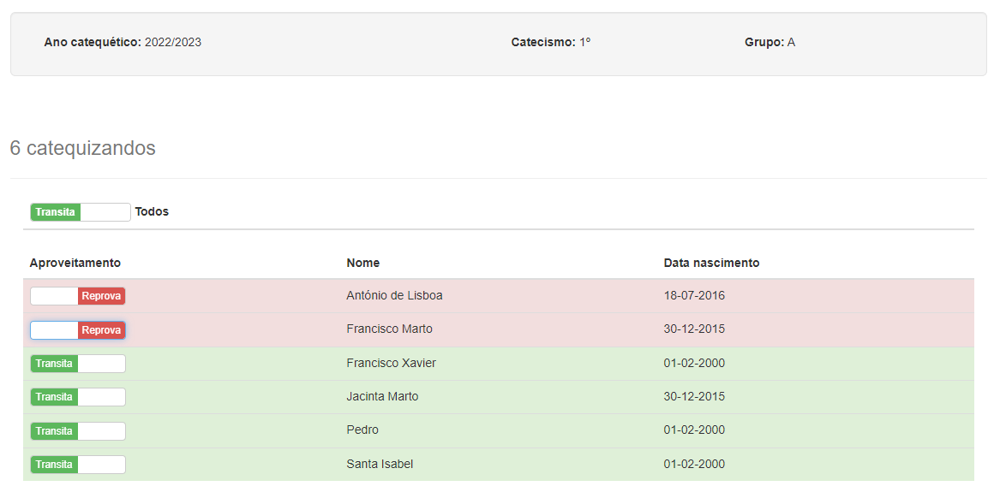

<i> - Registo do aproveitamento dos meus catequizandos - </i>

#### 2.6.2 Abrir/fechar o período de avaliação 

Aceda ao menu _Catequese_ e seleccione _Aproveitamento dos catequizandos_.

Se a sua conta for de _Administrador_, surgirá no topo da janela um painel semelhante ao da figura abaixo:

<i> - Abrir/fechar o período de avaliação - </i>

Este painel também se contra no ecrã _Configurações_ (ícone da roda dentada no canto superior direito do ecrã). 

Clique ou deslize o botão azul. Quando o botão está definido para _ON_, o período de avaliação está aberto, e todos os catequistas podem avaliar os seus catequizandos. Quando o botão está definido para _OFF_, os catequistas não poderão alterar a avaliação dos catequizandos.

### 2.7 Gerar listagens de catequizandos 

Aceda ao menu _Catequizandos_ e selecione uma das opções disponíveis abaixo da linha _Listar catequizandos_. As várias opções são descritas em seguida.

Todas as listagens de sacramentos incluem o nome do catequizando, data de nascimento, a data e paróquia do sacramento em causa.

#### 2.7.1 Listar baptismos

Gera uma listagem de todos os baptismos registados na base de dados. Pode filtrar os resultados por ano do baptismo e/ou por paróquia.

#### 2.7.2 Listar primeiras comunhões

Gera uma listagem de todas as primeiras comunhões registadas na base de dados. Pode filtrar os resultados por ano da primeira comunhão e/ou por paróquia.

#### 2.7.3 Listar profissões de fé

Gera uma listagem de todas as profissões de fé registadas na base de dados. Pode filtrar os resultados por ano da profissão de fé e/ou por paróquia.

#### 2.7.4 Listar confirmações

Gera uma listagem de todas as confirmações registadas na base de dados. Pode filtrar os resultados por ano da confirmação e/ou por paróquia.

#### 2.7.5 Listar escuteiros

Gera uma listagem de todos os catequizandos que são escuteiros e que estão inscritos nalgum grupo de catequese neste ano catequético.

### 2.8 Consultar/Imprimir sacramentos de todos os catequizandos

É possível listar de uma forma sucinta todos os sacramentos de um conjunto de catequizandos, sob a forma de ícones:

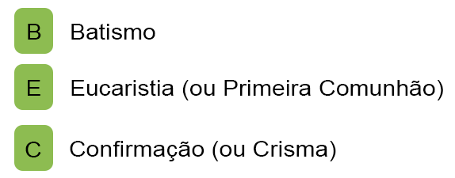

<i> - Sacramentos - </i>

Um ícone verde  indica que o sacramento em causa foi realizado na Paróquia. Um ícone cinzento  indica que o sacramento foi realizado noutra paróquia.
Um ponto verde sobre o ícone indica que o comprovativo do respetivo sacramento foi carregado no CatecheSis e está disponível no arquivo do catequizando.

  
<b>NOTA:</b>
  Deste modo, é fácil determinar para um grupo de catequese quais são as certidões de baptismo (por exemplo) que são necessárias pedir aos encarregados de educação, e quais aquelas que podem ser obtidas nesta mesma paróquia sem necessidade de incomodar os encarregados de educação.
  

Os ícones dos sacramentos estão disponíveis nas seguintes listagens:

#### 2.8.1 Os meus catequizandos

Aceda ao menu _Catequizandos_ > _Os meus catequizandos_.

Clique em _Mostrar sacramentos._

#### 2.8.2 Pesquisa por ano/catecismo

Aceda ao menu _Catequizandos_ > _Por ano / catecismo_.

Efetue uma pesquisa e depois clique em _Mostrar sacramentos._

#### 2.8.3 Pesquisa por catequista

Aceda ao menu _Catequizandos_ > _Por catequista_.

Efetue uma pesquisa e depois clique em _Mostrar sacramentos._

<i> - Apresentação dos sacramentos dos catequizandos - </i>

  
<b>NOTA:</b>
  Para imprimir a listagem com os sacramentos a cores (verde/cinzento), certifique-se de que o <i>navegador</i> está configurado para imprimir <i>cores de fundo e imagens</i>. Ver o <b>item IV</b> em <b>Problemas Conhecidos</b>
  

### 2.9 Utilizar as ferramentas de apoio à decisão

O CatecheSis dispõe de uma ferramenta de apoio à decisão que o ajuda a decidir quais os catequizandos que estão aptos para receber um determinado sacramento neste ano catequético, tendo em consideração o seu percurso catequético e algumas regras pré-definidas, bem como a detectar eventuais incorreções nas fichas dos catequizandos.

  
<b>NOTA:</b>
   Se for um administrador, esta ferramenta irá mostrar-lhe um relatório completo com todos os catequizandos inscritos neste ano catequético.
   Caso contrário, apenas serão mostrados catequizandos dos seus grupos de catequese.
  

#### 2.9.1 Listar catequizandos elegíveis para Baptismo

Aceda ao menu _Sacramentos_ e, na secção _Apoio à decisão_, clique em _Baptismos_.

O relatório apresenta-lhe todos os catequizandos inscritos neste ano catequético, divididos em três listas:

- **Elegíveis para receber o sacramento** - aqueles que, em princípio, poderão receber o sacramento neste ano catequético. Confirme na coluna _Relatório_ se existem algumas ações necessárias a realizar antes da data do sacramento.
- **Não cumprem os requisitos** - aqueles que, por não cumprirem todos os requisitos necessários, estão à partida impedidos de receber o sacramento neste ano catequético. Os requisitos podem corresponder à frequência de um determinado ano de catequese, ou a frequência da catequese há pelo menos dois anos, por exemplo.
- **Já receberam o sacramento** - catequizandos que, por já terem recebido o sacramento, são excluídos das duas listas anteriores.

Clique no título de cada uma destas listas para a expandir / colapsar.

A coluna _Relatório_ alerta para eventuais problemas a resolver, tais como comprovativos de baptismo em falta, datas de sacramentos incorretas ou incompletas nas fichas dos catequizandos.

Os catequizandos em cada uma das três listas são ordenados por ordem de gravidade dos problemas reportados na coluna _Relatório_.

#### 2.9.2 Listar catequizandos elegíveis para Primeira Comunhão

Aceda ao menu _Sacramentos_ e, na secção _Apoio à decisão_, clique em _Primeiras Comunhões_.

O relatório funciona conforme descrito na secção [2.9.1 Listar catequizandos elegíveis para Baptismo](#listar-catequizandos-elegiveis-para-baptismo).

#### 2.9.3 Listar catequizandos elegíveis para Crisma

Aceda ao menu _Sacramentos_ e, na secção _Apoio à decisão_, clique em _Crismas_.

O relatório funciona conforme descrito na secção [2.9.1 Listar catequizandos elegíveis para Baptismo](#listar-catequizandos-elegiveis-para-baptismo).

#### 2.9.4 Listar catequizandos com dados inconsistentes

Aceda ao menu _Análise_ e, na secção _Dados_, clique em _Dados insconsistentes_.

Neste relatório, são reportados outros tipos de problemas relacionados com as fichas dos catequizandos, tais como dados incompletos ou incorretos.

Apesar do conteúdo e da finalidade serem diferentes, o aspeto do relatório e o seu funcionamento é muito semelhante ao dos relatórios de apoio à decisão para sacramentos, descritos nas secções anteriores.

### 2.10 Consultar estatísticas acerca da catequese paroquial

Aceda ao menu _Estatísticas_ e selecione uma das opções disponíveis. As várias opções são descritas em seguida.

#### 2.10.1 Número de catequizandos por catequista

O gráfico mostra a evolução do número de catequizandos por cada catequista, ao longo dos anos catequéticos.

A tabela mostra o número total de catequizandos que já passaram por cada catequista (contabilizando apenas os dados de anos catequéticos presentes na base de dados do CatecheSis).

A coluna _Total de catequizandos_ soma indiscriminadamente os valores apresentados no gráfico para um dado catequista.

A coluna _Total de catequizandos distintos_ é mais significativa, pois não soma duas vezes o mesmo catequizando.

#### 2.10.2 Desistências

O 1º gráfico mostra o número de desistências por ano catequético.

Considera-se uma desistência no ano catequético de 2014/2015, por exemplo, se um catequizando inscrito num grupo de catequese nesse ano não se inscrever em nenhum grupo de catequese no ano catequético 2015/2016, excepto no caso de o catequizando estar no 10º catecismo em 2014/2015 (nesse caso considera-se que terminou o percurso catequético).

O 2º gráfico mostra a percentagem de desistências por ano catequético.

A percentagem é obtida dividindo o número calculado no gráfico anterior para um determinado ano catequético pelo número total de catequizandos inscritos nalgum grupo de catequese nesse mesmo ano catequético.

  
<b>NOTA:</b>
  O CatecheSis contabiliza as desistências por comparação entre as inscrições num determinado ano catequético e as inscrições no ano seguinte. Por esse motivo, a estatística <i>Desistências</i> só é apresentada até ao ano catequético anterior ao ano atualmente em curso.
  

#### 2.10.3 Percursos catequéticos completos

O 1º gráfico mostra o número de catequizandos que terminaram o percurso catequético, por ano catequético.

Considera-se que um percurso catequético é completo no ano em que o catequizando, tendo já completado o 10º catecismo (nesse ano ou num ano anterior), recebe o sacramento da Confirmação.

O 2º gráfico mostra a percentagem de percursos catequéticos completos num determinado ano, face ao ideal esperado para esse mesmo ano.

O ideal esperado corresponde ao número máximo de catequizandos que poderiam nesse ano terminar o 10º catecismo e receber o sacramento da Confirmação. Por exemplo, se considerarmos o ano de 2014/2015, são contabilizados para o ideal esperado todos os catequizandos inscritos no 10º catecismo nesse ano, mais os inscritos no 9º catecismo em 2013/2014, mais os inscritos no 8º catecismo em 2012/2013... A situação que maximiza a percentagem (100%) acontece quando num grupo de catequese nunca se verificarem desistências, ano após ano.

#### 2.10.4 Percentagem de catequizandos residentes na paróquia

O gráfico mostra a percentagem de catequizandos residentes e não residentes na área geográfica servida pela sua paróquia, considerando todos os catequizandos registados na base de dados (independentemente de estarem ou não inscritos num grupo de catequese neste ano).

Considera-se um catequizando residente na paróquia se o código postal constante na sua ficha de inscrição pertencer a um conjunto de códigos postais considerados inclusos no território da paróquia (estes devem ser definidos na base de dados pela pessoa que instalou o CatecheSis).

### 2.11 Criar uma sessão de Catequese Virtual

Aceda ao menu _Catequese_ e selecione a opção _Criar Catequese Virtual_.

Incialmente selecione o Catecismo/Grupo e a data que pretende.

Através da caixa de texto e das diversas ferramentas disponíveis (formatação de texto, inserção de videos, imagens e hiperligações) é possivel criar uma catequese dinâmica e bem estruturada. 

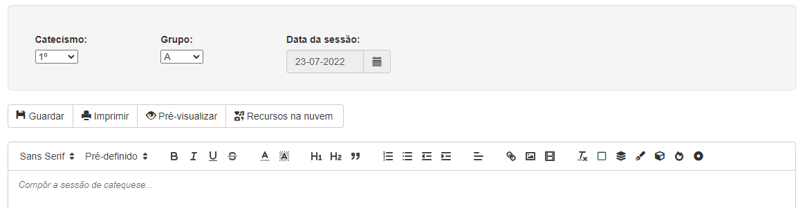

<i> - Criar uma sessão de Catequese Virtual - </i>

Para além das ferramentas enumaradas anteriormente, o Catechesis pode dispor ainda de **Rrecursos na nuvem**, onde estão armazenados materias (tais como imagens, separadores, ícones) disponiblizados pelos catequistas da sua paroquia, e para os quais também pode contribuir;

  
<b>NOTA:</b>
    A funcionalidade <i>Recursos na nuvem</i> requer a existência da Catequese Cloud, cuja instalação é opcional, e poderá não estar disponível na sua paróquia.
    Contacte a pessoa responsável pela instalação do CatecheSis na sua paróquia.
  

Quando o conteúdo da catequese estiver concluido, ou regularmente durante a sua criação, selecione a opção _Guardar_.

Se pretender visualizar o resultado final, selecione a opção _Pré-visualizar_.

### 2.12 Inscrever um catequizando 

  
<b>NOTA:</b> 
  Antes de inscrever um novo catequizando, poderá ser-lhe muito útil saber se este tem algum irmão já inscrito na catequese.
  Se tem conhecimento de que o catequizando a inscrever já tem um irmão na catequese, salte directamente para o tópico <b>2.12.2 Inscrever um irmão</b> 
  

#### 2.12.1 Inscrever um novo catequizando (offline)

Aceda ao menu _Inscrições_ e selecione a opção _Inscrever novo catequizando_.

Preencha o formulário de inscrição. Todos os campos são obrigatórios, excepto o endereço de _e-mail_, um dos contactos telefónicos e os dados de um dos pais.

Se o seu computador tiver uma _webcam_,pode opcionalmente tirar uma fotografia ao catequizando clicando no botão _Tirar foto_.

No painel inferior é possível ainda atribuir o catequizando a um grupo de catequese do ano catequético atual. Isto também pode ser feito mais tarde, através do Arquivo.

Clique no botão _Inscrever_.

Depois de concluída a inscrição, pode consultar imediatamente a ficha do catequizando, o arquivo (onde poderá [2.14 Atribuir um catequizando a um grupo de catequese](#atribuir-um-catequizando-a-um-grupo-de-catequese), ou inscrever um irmão deste catequizando.

#### 2.12.2 Inscrever um irmão

Aceda primeiro à ficha do irmão do catequizando que pretende inscrever. Pode utilizar qualquer um dos métodos descritos neste manual para aceder à ficha. Consulte [2.3 Procurar e consultar a ficha de um catequizando](#procurar-e-consultar-a-ficha-de-um-catequizando)

Aceda agora ao menu _Inscrições_ e selecione a opção _Inscrever um irmão deste catequizando_.

<i> - Inscrição de um irmão - </i>

Surgirá um formulário de inscrição pré-preenchido com os dados dos pais, morada, telefones e _e-mail_, assumindo que se tratam dos mesmos dados do irmão. Complete a informação em falta e altere o que for necessário.

Siga as mesmas instruções do tópico anterior, [2.12.1 Inscrever um novo catequizando (offline)](#inscrever-um-catequizando)

  
<b>NOTA:</b> 
  Se durante a inscrição deste catequizando alterar algum dos dados comuns às fichas dos irmãos (ex: morada, telefones, <i>e-mail</i> ou profissão dos pais) esses dados serão automaticamente atualizados nas fichas de todos os irmãos.
  

### 2.13 Renovar matrículas 

Aceda ao menu _Inscrições_ e seleccione _Renovar matrículas_.

No painel superior, selecione o último ano catequético concluído, o catecismo e grupo dos catequizandos para os quais pretende renovar a matrícula para o ano seguinte.

<i> - Seleção do último ano catequético concluído, o catecismo e grupo dos catequizandos - </i>

Nos painéis inferiores selecione o grupo onde devem ser inscritos no ano seguinte os catequizandos que foram aprovados e os que foram reprovados.

<i> - Seleção do grupo onde os catequizandos devem ser inscritos - </i>

Em baixo surge uma lista com todos os catequizandos do ano/grupo selecionado.

É apresentado o aproveitamento do catequizando (avaliado pelos seus catequistas) à direita do seu nome. Se o aproveitamento de um catequizando for positivo (_Transita_), será automaticamente inscrito no catecismo e grupo selecionados no painel _Aprovados_, caso renove a matrícula. Se o aproveitamento for negativo (_Reprova_), será automaticamente inscrito no catecismo e grupo selecionados no painel _Reprovados_.

Para cada catequizando, indique se renova a matrícula clicando ou deslizando o botão localizado à esquerda do seu nome. Indique se a matrícula foi paga na coluna _Pago?_.

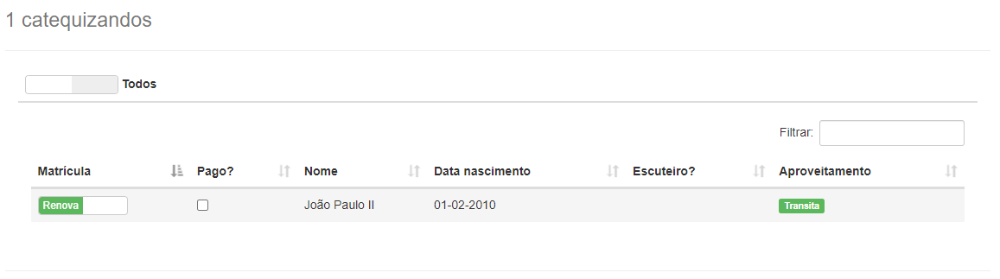

<i> - Indicação de renovação de matrícula e repetivo pagamento - </i>

Para terminar, clique em Guardar, no topo da janela.

  
<b>NOTA:</b>
  A página de renovações de matrícula também apresenta um painel com os pedidos de renovação feitos online, caso esteja a utilizar essa funcionalidade na sua paróquia. 
  Leia também a secção <b>2.15.4 Aprovar renovações</b> para saber mais sobre como utilizar esta funcionalidade.
  

### 2.14 Atribuir um catequizando a um grupo de catequese 

Aceda ao arquivo do catequizando, conforme descrito no tópico [2.4 Consultar o arquivo acerca de um catequizando](#consultar-o-arquivo-acerca-de-um-catequizando).

No painel _Percurso catequético_, concentre-se sobre a última linha da tabela. Preencha o ano catequético e o catecismo onde pretende colocar o catequizando. Seleccione a caixa _pago_ se a inscrição foi paga. Clique em _Adicionar_.

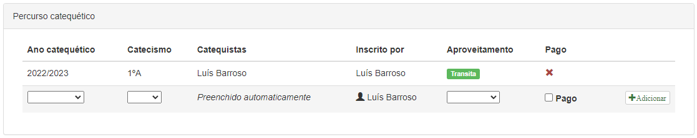

<i> - Atribuição de um catequizando a um grupo de catequese - </i>

É possível também retirar o catequizando de um grupo de catequese ou registar um pagamento posterior à inscrição. Para tal posicione o rato sobre a linha da tabela respeitante ao ano catequético que pretende e surgirão botões para efectuar estas acções.

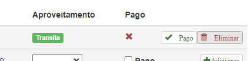

<i> - Alterar o catequizando de um grupo de catequese e registo de 
pagamento - </i>

  
<b>NOTA:</b>
  A coluna <i>Catequistas</i> é preenchida automaticamente quando forem definidos os catequistas para aquele grupo de catequese. Consulte <b>2.16 Criar e gerir grupos de catequese</b>
  

Se pretender transferir o catequizando para outro grupo de catequese, remova-o primeiro do grupo atual e inscreva-o de seguida no novo grupo, seguindo as instruções acima.

### 2.15 Gerir inscrições online 

#### 2.15.1 Abrir/fechar as inscrições online

Para abrir ou fechar o portal de inscrições e renovações de matrículas online, para encarregados de educação, comece por aceder à página de _Configurações_ (ícone da roda dentada no canto superior direito do ecrã).

Na secção _Inscrições online_ deslize o interruptor de modo a que _ON_ fique visível.

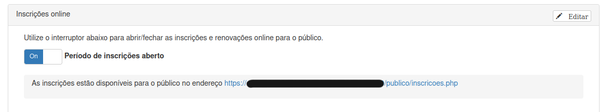

<i> - Abrir/fechar inscrições online - </i>

  
<b>NOTA:</b> 
  Para ligar/desligar interruptores como este, não é necessário clicar no botão <i>Editar</i> no canto superior direito do painel. A alteração é imediata.
  

A caixa imediatamente abaixo do interruptor indica-lhe o endereço do portal de inscrições online, que poderá divulgar junto dos encarregados de educação e interessados.

Os restantes campos do painel permitem-lhe configurar um texto informativo a ser mostrado na página de inscrições, bem como a referência multibanco para receber donativos.

À medida que forem chegando pedidos de inscrição/renovação, será mostrado o número de pedidos pendentes no menu _Inscrições_.

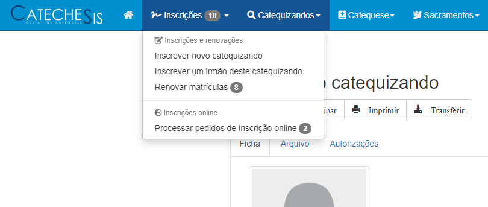

<i> - Número de pedidos pendentes - </i>

Para visualizar um resumo de todos os pedidos, aceda ao menu _Inscrições > Processar pedidos de inscrição online._

#### 2.15.2 Visualizar pedidos de novas inscrições

O primeiro separador apresenta os **pedidos de inscrição**, para quem se inscreve pela primeira vez.

<i> - Novas inscrições - </i>

O programa sugere um catecismo para cada candidato, com base na sua idade e também no último catecismo que ele frequentou (caso tenha vindo de outra paróquia). Deste modo, já consegue prever quantos catequizandos novos entrarão em cada catecismo.

#### 2.15.3 Visualizar pedidos de renovação de matrícula

O separador **Renovações de matrícula** mostra de forma semelhante os pedidos de renovação que forem recebidos.

Aqui pode ser visualizada a informação completa de um pedido clicando sobre essa linha da tabela.

Esta página mostra o total de pedidos de renovação de todos os catecismos, no entanto, não é aqui que se processa a renovação.

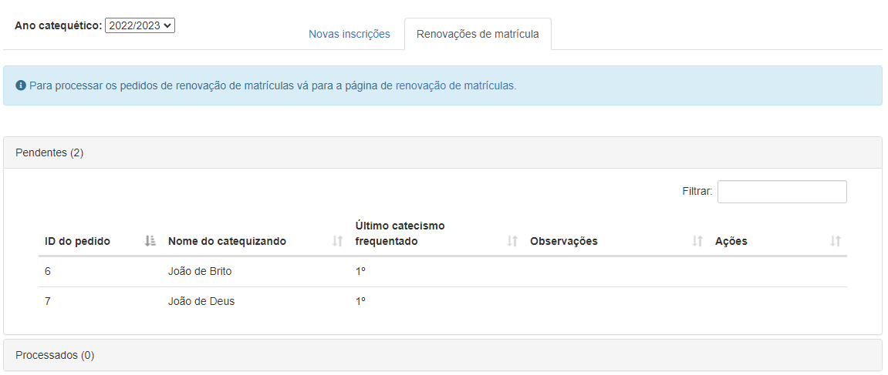

<i> - Renovações de matrícula - </i>

#### 2.15.4 Aprovar renovações

Para **aprovar uma renovação**, aceda ao menu _Inscrições > Renovar matrículas._

Depois de criar os novos grupos para o novo ano catequético, selecione nesta página o ano catequético anterior e um catecismo.

Surgirá a listagem dos catequizandos inscritos no grupo no ano anterior.

No final da listagem, um painel azul que mostra os pedidos de renovação para esse catecismo que foram feitos online.

Verifique se o nome de um catequizando aparece simultâneamente na listagem e no painel de renovações online. Em caso afirmativo, ative o botão à esquerda do nome dele (que fica verde) em ambas as listas. 

Sugerimos que também verifique, sobre a linha do pedido, o telefone e o e-mail, e confirme na ficha do catequizando (clicando sobre ele na primeira listagem) se esses dados estão atualizados. Se não estiverem, pode aproveitar para os atualizar, porque isso não é feito automaticamente.

Por fim clique no botão _Guardar_.

<i> - Aprovar renovações - </i>

Nesse momento a renovação fica efetivamente aprovada, e o pedido passa para a lista de _Processados_.

  
<b>NOTA 1:</b> 
  Ao aprovar os pedidos de renovação, não tem de processar um de cada vez. Pode selecionar simultâneamente vários catequizandos nas listas e clicar em <i>Guardar.</i>
  

  
<b>NOTA 2:</b> 
  Quando os encarregados de educação fazem a inscrição/renovação online, é-lhes atribuído um número de inscrição que eles são aconselhados a guardar ou imprimir. Este número é o <i>ID do pedido</i> que pode consultado nas tabelas. Assim, se algum encarregado de educação tiver alguma dúvida sobre a inscrição, basta indicar o <i>ID do pedido</i> e um administrador pode encontrá-lo rapidamente na lista de pedidos pendentes ou processados.
  

  
<b>NOTA 3:</b> 
  Existe uma barra de pesquisa no canto superior direito destas tabelas de pedidos que filtra pedidos por ID, nome da criança ou catecismo. Também pode ordenar os pedidos por qualquer uma das colunas (ID, nome, catecismo).
  

  
<b>NOTA 4:</b> 
  Se receber pedidos estranhos/duvidosos, há um botão para eliminar. No entanto, recomendamos que só elimine nesses casos. O procedimento normal deve ser marcar um pedido como processado e não eliminá-lo, porque o pedido é a única prova que a coordenação da catequese detém de que o encarregado de educação realmente efetuou o pedido de inscrição.

### 2.16 Criar e gerir grupos de catequese 

Aceda ao menu _Catequese_ e selecione a opção _Gerir grupos de catequese_.

#### 2.16.1 Criar grupos para um novo ano catequético

Clique no separador _Novo ano catequético_.

Escreva na caixa o ano catequético para o qual pretende criar grupos. Pode escolher uma de duas opções:

- Criar 10 grupos de catequese, com 1 grupo por cada catecismo;
- Criar um número de catecismos e grupos igual ao do último ano catequético registado na base de dados do CatecheSis;

  
<b>NOTA:</b>
  A segunda opção só estará disponível se já existir pelo menos um ano catequético na base de dados.
  

Clique em _Criar_.

Em seguida, poderá adicionar grupos de catequese ou remover alguns dos grupos criados automaticamente neste passo.

#### 2.16.2 Adicionar/remover grupos num ano catequético existente

Aceda agora ao separador _Anos catequéticos existentes_ e selecione um ano catequético na caixa de selecção.

Para adicionar um novo grupo de catequese, posicione-se na última linha da tabela. Seleccione um catecismo e um grupo nas caixas de selecção e clique em _Adicionar_.

Para remover um grupo de catequese, posicione o rato sobre a respectiva linha da tabela. Surge então à direita, na mesma linha, o botão _Eliminar._

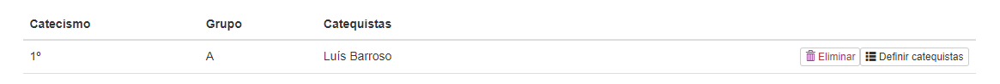

<i> - Adicionar/remover grupos num ano catequético existente - </i>

#### 2.16.3 Definir os catequistas para um grupo de catequese

Aceda ao separador _Anos catequéticos existentes_ e selecione um ano catequético na caixa de selecção.

Posicione o rato sobre a respectiva linha da tabela respeitante ao grupo de catequese que pretende modificar. Surge então à direita, na mesma linha, o botão _Definir catequistas._

<i> - Definir os catequistas para um grupo de catequese - </i>

Clique no botão e será conduzido(a) para o painel _Definir catequistas_, localizado no fundo da página.

Para adicionar um catequista ao grupo de catequese, selecione o seu nome na caixa de selecção e clique em _Adicionar_.

Para retirar um catequista do grupo de catequese, posicione o rato sobre a linha que contém o seu nome e clique no botão _Remover_ que surgirá à direita, na mesma linha.

  
<b>NOTA:</b>
  Ao adicionar um catequista a um grupo de catequese, só encontrará na caixa de selecção os nomes de utilizadores com o atributo de <i>Catequista ativo</i>. Consulte <b>2.17 Criar e gerir utilizadores e catequistas</b>.
  

### 2.17 Criar e gerir utilizadores e catequistas 

Aceda ao menu _Catequese_ e selecione a opção _Gerir utilizadores e catequistas_.

#### 2.17.1 Criar uma nova conta de utilizador / catequista

Aceda ao separador _Novo utilizador_.

Preencha o formulário, tendo em conta que o campo _Nome de utilizador_ não poderá jamais ser modificado, nem a conta de utilizador eliminada.

Seleccione o tipo de conta. Para mais informações consulte [1.2 Tipos de contas](#tipos-de-contas), neste manual.

Clique no botão _Criar_.

  
<b>NOTA:</b>
  Poderá atribuir e revogar privilégios de administrador ou redefinir o estado do catequista mais tarde.
  

#### 2.17.2 Modificar a conta de um utilizador

Aceda ao separador _Utilizadores existentes_.

Posicione o rato sobre a linha correspondente ao utilizador que pretende modificar. Clique no botão _Acções_, que surgirá na mesma linha, à direita.

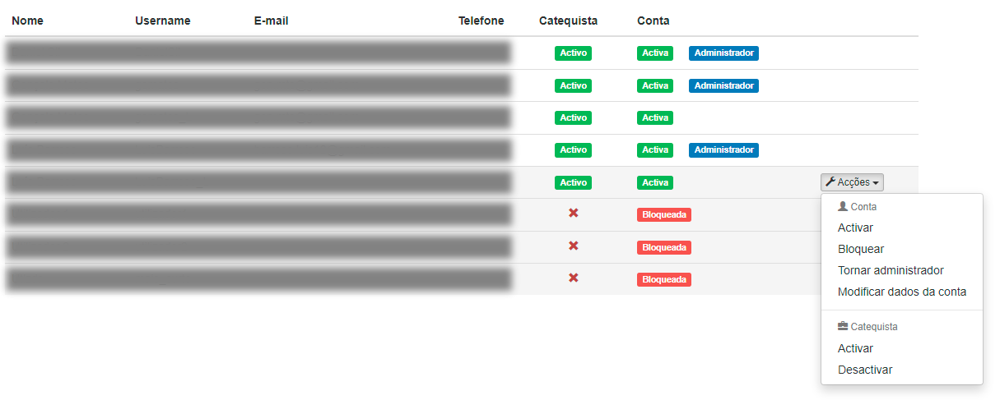

<i> - Modificar a conta de um utilizador - </i>

As opções disponíveis para a conta são descritas de seguida:

- **Ativar** – Desbloqueia uma conta previamente bloqueda.
- **Bloquear** – Impede que o utilizador inicie sessão no CatecheSis. Se for catequista, o seu nome ainda poderá ser atribuído a grupos de catequese.
- **Modificar dados da conta** – Permite alterar o nome, e-mail, telefone e password do utilizador.
- **Tornar administrador** - Atribui privilégios de administrador à conta do utilizador.
- **Dispensar administrador** - Remove os privilégios de administrador à conta do utilizador.

As opções disponíveis relativamente ao atributo catequista são descritas de seguida:

- **Ativar** – Define o tipo de conta como _Catequista ativo_. O nome deste catequista passa a poder ser selecionado para constituir grupos de catequese.
- **Desativar** – Define o tipo de conta como _Catequista inativo._ O nome deste catequista deixa de poder ser seleccionado para constituir grupos de catequese. No entanto, se o catequista já está inserido num grupo permanece inserido nesse grupo de catequese.

  
<b>NOTA 1:</b>
  Não é possível bloquear nem revogar os privilégios de administrador da sua própria conta. Peça a outro administrador para o fazer. 
  

  
<b>NOTA 2:</b>
  Não é possível eliminar a conta de um utilizador. Se deseja impedir que este utilizador aceda ao sistema, bloqueie a conta. Se o utilizador deixou de ser catequista, defina-o como <i>Catequista inativo</i> e bloqueie a conta.
  

### 2.18 Alterar configurações do Catechesis

Aceda à página de Configurações selecionando a _roda dentada_ na barra superior do CatecheSis.

Os vários painéis nesta página permitem configurar diversos aspetos do CatecheSis consoante as suas necessidades, nomeadamente:

#### 2.18.1 Dados da conta

- Modificar o nome, e-mail, telefone e palavra-passe da sua conta. 

_Veja também [2.1 Modificar os dados da minha conta](#modificar-os-dados-da-minha-conta)_.

#### 2.18.2 Inscrições online 

- Definir o período de abertura/fecho das inscrições online; 
- Definir um texto informativo a ser mostrado na página de inscrição/renovação de matrículas online; 
- Definir uma referência multibanco para pagamento da inscrição/renovação; 

#### 2.18.3 Aproveitamento dos catequizandos 

- Ativar/desativar a possibilidade de os catequistas registarem o aproveitamento dos catequizandos.

#### 2.18.4 Catequese (operacionalização) 

- Definir o dia em que a catequese é ministrada:
- Definir o número de anos do percurso catequético (catecismos):

#### 2.18.5 Integração com Nextcloud 

- Alteração das _URLs_ relacionadas com a Catequese Cloud.

#### 2.18.6 Personalizar página pública 

- Se pretender uma página pública mais personalizada, é possivel definir uma imagem à sua escolha, como um logotipo da paróquia, uma fotografia da igreja, entre outros. Caso não seja definida nenhuma imagem o CatecheSis apresenta uma imagem padrão.

#### 2.18.7 Dados da paróquia 

- Definir o logotipo da paróquia e as respetivas informações (nome, localidade, diocese e país).

  
<b>IMPORTANTE:</b>
  A configuração do <b>país</b> define determinados ajustes regionais, tais como o número de dígitos dos códigos postais
e telefones, a exibição dos anos catequéticos e os seus meses de início/fim (por exemplo, em Portugal a catequese decorre
geralmente entre Setembro e Junho, enquanto no Brasil costuma ser entre Março e Dezembro). 
  É importante por isso que defina corretamente o país onde está a utilizar o CatecheSis.
  

#### 2.18.8 Proteção de dados (RGPD) 

- Definir os reponsáveis pelo tratamento de dados, necessários para o Regulamento Geral sobre a Proteção de Dados (RGPD). Estes dados são utilizados para gerar automaticamente a declaração de consentimento de tratamento de dados pessoais, apresentada aos encarregados de educação que efetuarem uma inscrição/renovação de matrícula online.

### 2.19 Monitorizar os acessos ao CatecheSis 

Aceda ao menu _Análise_ e selecione a opção _Registos de atividade do sistema_.

O separador _Actividade no CatecheSis_ dá acesso aos registos das acções dos utilizadores, tais como inscrições de novos catequizandos, modificação e eliminação de fichas, criação e alteração da constituição de grupos de catequese, modificação de dados pessoais, criação ou modificação de contas de utilizadores.

Os registos incluem data, hora e o nome de utilizador, além de uma descrição da acção efectuada.

O separador _Autenticações_ regista a data, hora e endereço de rede da máquina utilizada por cada utilizador quando este se autentica. São registadas todas as autenticações no sistema, bem como todas as tentativas falhadas de autenticação e ainda eventos de criação de novas contas de utilizador.

  
<b>NOTA:</b>
  Não é possível modificar nem eliminar os registos de atividade nem de autenticações.
  Registos muito antigos são automaticamente eliminados à medida que novos são introduzidos, de acordo com regras pré-estabelecidas no CatecheSis.
  

### 2.20 Manter o CatecheSis atualizado 

### 2.20.1 Notificação de atualização

O CatecheSis procura automaticamente a existência de atualizações periodicamente.

Quando estiver disponível uma nova versão, o CatecheSis irá apresentar um novo ícone no canto superior direito da barra 
de menu, que corresponde a uma seta ascendente.

Clique no ícon da seta para abrir a notificação de atualização.

A notificação indica a versão do CatecheSis atualmente instalada no seu servidor e a versão disponível para transferir.

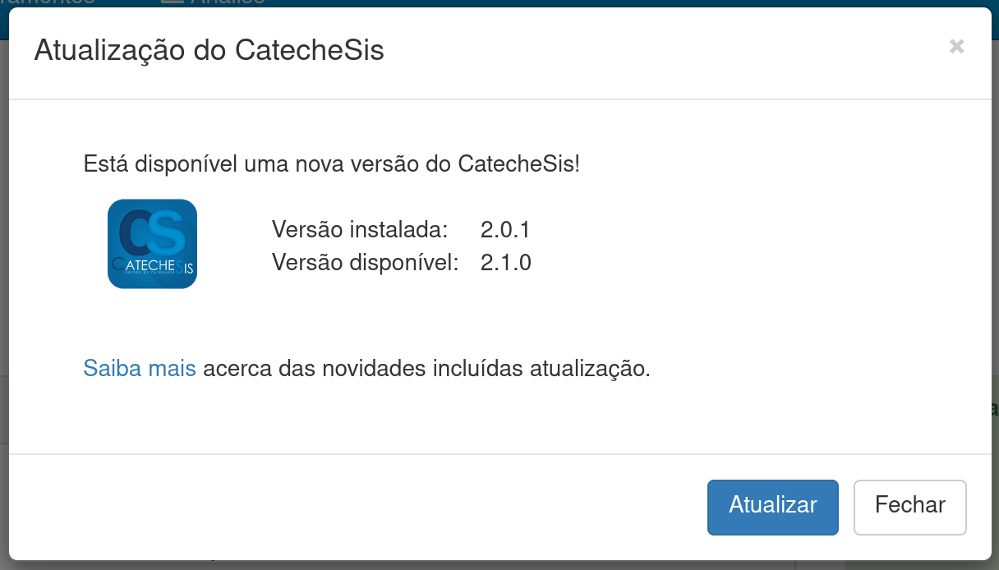

Faça clique sobre o botão *Atualizar* para lançar o Assistente de Atualização.

### 2.20.2 Verificar manualmente a existência de atualizações

Apesar de o CatecheSis procurar automaticamente, e de forma periódica, a existência de atualizações, pode também
verificar manualmente a existência de atualizações.

Aceda ao menu ❔ (Ajuda), no canto superior direito da barra de menu, e clique em *Acerca do CatecheSis...*.

Na caixa de diálogo "Acerca do CatecheSis", clique no botão *Procurar atualizações*, por baixo da versão.

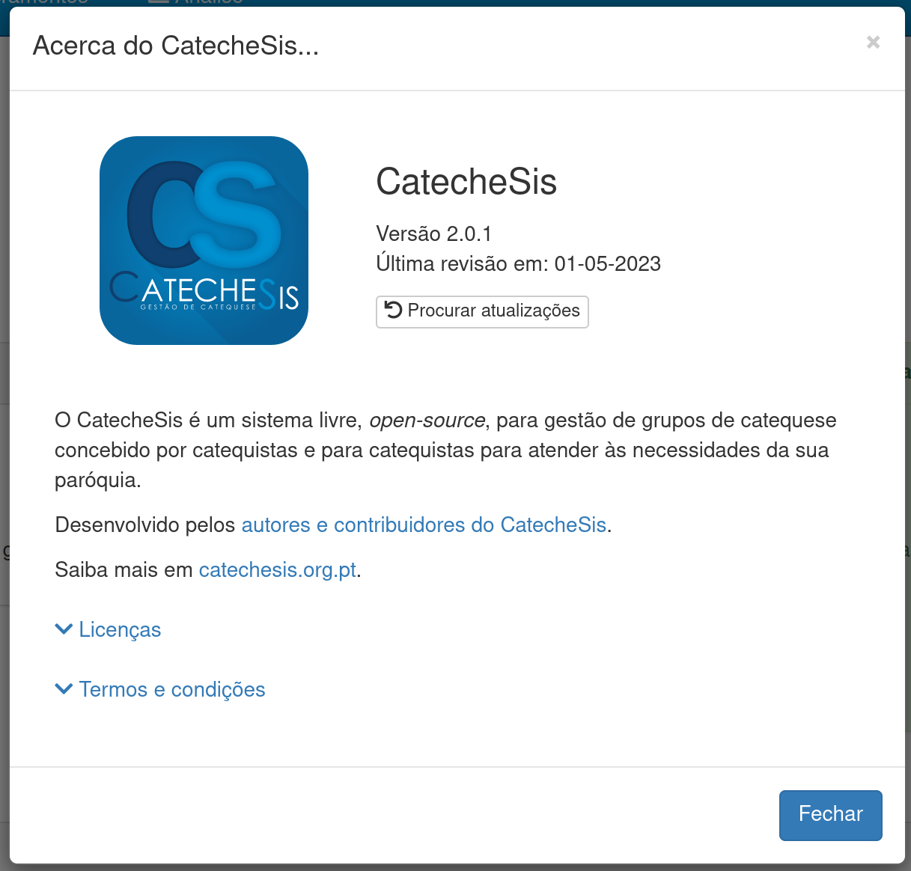

O Assistente de Atualização irá verificar se existe uma nova versão disponível e permitir-lhe-á aplicar a atualização.

### 2.20.3 Utilizar o Assistente de Atualização

O Assistente de Atualização verifica se existe uma nova versão do CatecheSis disponível e permite-lhe descarregar e 
aplicar automaticamente a atualização.

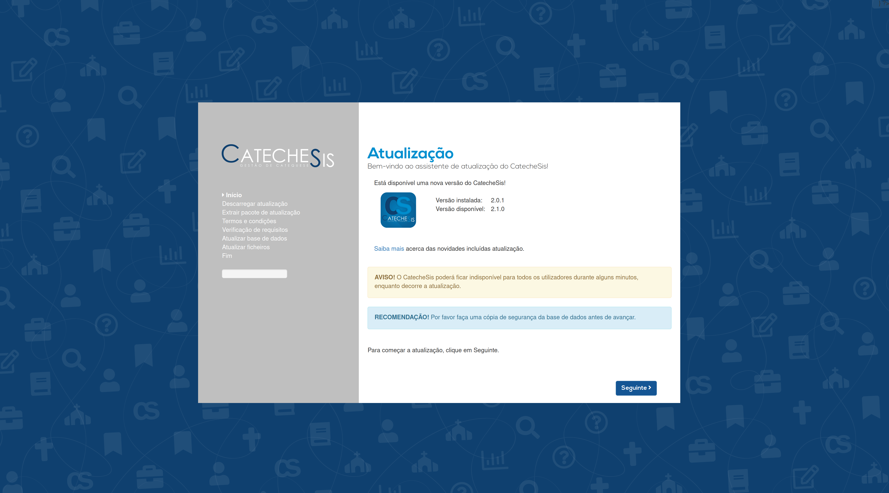

Se estiver disponível uma nova versão do CatecheSis, faça clique em *Seguinte* para iniciar o processo de atualização.

O CatecheSis irá transferir a atualização e aplicá-la.

  
<b>NOTA:</b>
  É recomendado que realize uma cópia de segurança da base de dados e da diretoria de dados do CatecheSis
  antes de proceder a uma atualização.
  

  
<b>NOTA:</b>
  É preferível escolher para a atualização uma hora em que não existam outros utilizadores a aceder ao CatecheSis,
  para minimizar o risco de erros ao atualizar a base de dados.
  

## 3. Requisitos de sistema

_Características essenciais_

Para utilizar o CatecheSis necessita de um dispositivo com acesso à Internet e com um _navegador web_.

O funcionamento do CatecheSis foi testado nos seguintes _navegadores_, em ambiente desktop _Windows_ e _Linux_. Recomenda-se a utilização de um destes _navegadores_ na sua versão mais recente:

- Mozilla Firefox
- Google Chrome\*
- Microsoft Edge\*

\*Estes _navegadores_ podem apresentar alguns problemas. Consulte [4. Problemas conhecidos](#problemas-conhecidos) neste manual.

Certifique-se ainda de que as seguintes funcionalidades estão ativas no seu _navegador_:

- JavaScript
- Cookies (permitir)
- Janelas de pop-up (permitir no CatecheSis)

Consulte a ajuda do seu _navegador_ para saber como ativar estas funcionalidades.

  
<b>NOTA:</b>
  O CatecheSis não foi optimizado para dispositivos portáteis, tais como <i>smartphones</i> e <i>tablets</i>.
Alguns ecrãs poderão não ser legíveis. Algumas funcionalidades poderão não funcionar.
  

_Características opcionais_

Para fazer inscrições de catequizandos com fotografia é ainda necessário:

- Webcam
- Adobe Flash Player

Para utilizar algumas funcionalidades do CatecheSis, tais como exportar fichas de catequizandos e pesquisas, é ainda necessário:

- Software leitor de PDF
- Microsoft Office Word 2007 ou superior _(ou alternativa compatível)_
- Microsoft Office Excel 2007 ou superior _(ou alternativa compatível)_

## 4. Problemas conhecidos

Abaixo são discriminados alguns problemas conhecidos para os quais ainda não existe uma solução técnica eficaz. Para alguns deles são apresentadas sugestões para remediar o problema.

A lista poderá ser alargada à medida que novos problemas forem descobertos.

### 1. _Imprimir fichas e arquivo de catequizandos_

A funcionalidade de impressão é altamente dependente do _navegador_, existindo muito pouco controlo possível do lado do programador.

Se o conteúdo não for legível na página impressa, recomenda-se que experimente diferentes escalas de impressão, na janela de configuração de impressão do seu _navegador_.

Para as fichas recomenda-se que as transfira como um ficheiro do Microsoft Word e as imprima nesse programa.

### 2. _Imprimir listagens_

À data de escrita deste manual, verifica-se que as listagens de baptismos, primeiras comunhões, profissões de fé, confirmações e escuteiros, bem como a página _Os meus catequizandos_, só são correctamente impressas no _navegador_ Mozilla Firefox.

A impressão no _navegador_ Google Chrome omite o logotipo da catequese paroquial nas páginas subsequentes à primeira.

A impressão no _navegador_ Microsoft Internet Explorer sobrepõe o logotipo da catequese paroquial à listagem nas páginas subsequentes à primeira, impossibilitando a leitura de alguns nomes.

Uma alternativa é exportar a pesquisa como um ficheiro PDF ou do Microsoft Excel e imprimi-la nesse programa.

### 3. _Imprimir estatísticas_

A impressão de estatísticas não é atualmente suportada. Se tentar imprimir é expectável que os gráficos ultrapassem os limites dos painéis e não sejam completamente legíveis.

### 4. _As cores dos painéis e botões não aparecem nas páginas impressas_

Para garantir que as páginas impressas preservam as cores tal como mostradas no ecrã (ex: a cor verde nos ícones dos sacramentos), configure o seu _navegador_ para imprimir cores de fundo nas páginas. Procure essa opção nas configurações de impressão do _navegador_.