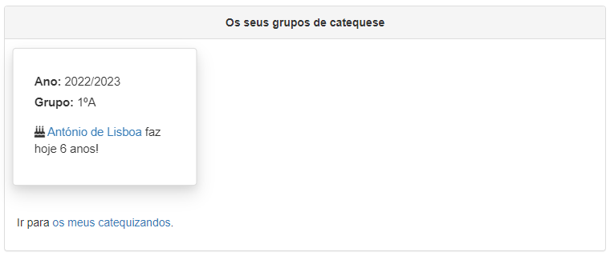
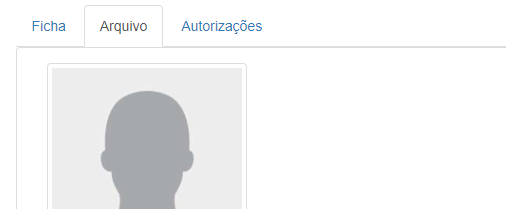
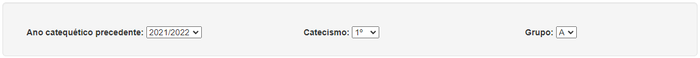
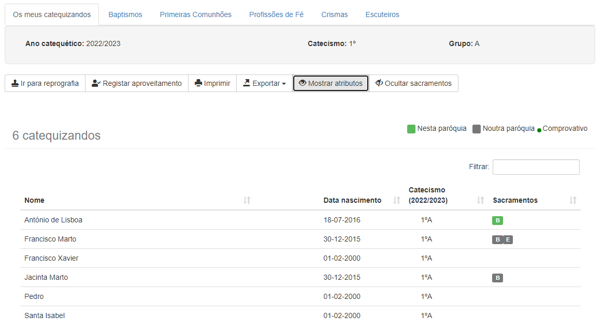
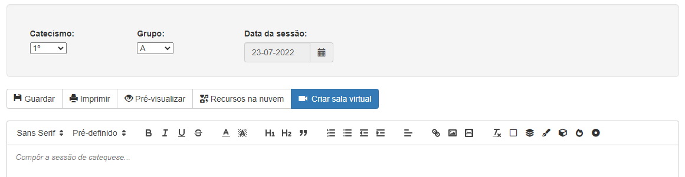

# Manual do Utilizador

Este manual destina-se a todos os utilizadores do CatecheSis.

## 1. Conceitos básicos
### 1.1 Utilizar os menus [RESCRITO]

A interface do CatecheSis apresenta permanentemente, no topo, uma barra de menus. Utilize os menus para efectuar tarefas e aceder às diversas funcionalidades do CatecheSis.

A sua localização actual está assinalada com uma tonalidade diferente.

No canto superior direito é apresentado o nome do utilizador autenticado (primeiro e último nome), selecionando o nome de utilizador é apresentada a opção de _Logout_. Utilize sempre o botão _Logout_ para terminar a sua sessão e sair do CatecheSis em segurança. Para além do utilizador são apresentados mais dois _icons_, as definições do CatecheSis e ajuda, onde é apresentado o Manual de Utilizador e alguma informação sobre o CatecheSis.

Ao centro da página é apresentada alguma informação util ao catequista:

- **Os seus grupos de catequese**: São apresentados os vários grupos de catequese assim como aniversários dentro desse mesmo grupo de Catequese. Ainda existe a possibilidade de ir para os meus catequizandos, de forma rápida.
- **Dados dos seus catequizandos**: Selecionando a opção _Ver relatório_ é apresentado um pequeno relatorio relativamente a dados inconsistentes dos seus catequizandos, por exemplo _Número de telefone inválido_, _O catequizando nunca esteve inscrito em nenhum grupo de catequese_, _A data de baptismo é anterior à data de nascimento_, _Comprovativo do baptismo em falta_, _Sem endereço de e-mail_. A cor da _caixa_ varia consoante a gravidade inconsistência de dados.
- **Acessos rápidos**: São apresentados os vários alguns acessos rápidos, úteis para o catequista. 

<i> - Página Principal do CatecheSis - </i>

<i> - Opções relativamente a inconsistência de dados dos catequizandos - </i>

<meta name="viewport" content="width=device-width, initial-scale=1">

</head>

<body>

  
<b>NOTA:</b> 
  Dependendo do seu tipo de conta de utilizador ou do contexto em que se encontra, algumas opções do menu poderão não estar visíveis ou não serem selecionáveis. Consulte <b>Tipos de contas</b> neste manual.
  

</body>

### 1.2 Tipos de contas

Existem vários tipos de contas de utilizador no CatecheSis.

Relativamente ao sistema, o seu tipo de conta pode ser:

- **Utilizador (simples)** – É o tipo de conta mais comum. Tem permissões para modificar os seus dados pessoais e aceder somente às fichas dos seus catequizandos (se for catequista), mas apenas para leitura. Permite ainda fazer pesquisas sobre a base de dados de catequizandos, imprimir a folha de presenças e as fichas do grupo em que dá catequese, e consultar as estatísticas da catequese paroquial.
- **Administrador** – Além de tudo o que um utilizador simples pode fazer, um Administrador pode ainda inscrever catequizandos, aceder à ficha de qualquer catequizando e modificar fichas, gerar e imprimir listagens de catequizandos (ex: baptismos, escuteiros, etc.), criar e gerir turmas de catequese, criar e modificar contas de outros utilizadores.

Relativamente à catequese, o seu tipo de conta pode ser:

- **Catequista activo** – Pode ser inserido numa turma de catequese no ano catequético actual.
- **Catequista inactivo** – Não pode ser inserido numa turma de catequese no ano catequético actual, mas já deu catequese no passado e/ou poderá vir a tornar-se um catequista activo no futuro.
- **Não catequista** – Nunca pode ser inserido numa turma de catequese. Este tipo de conta pode ser utilizada por um utilizador que apenas efectue tarefas administrativas, por exemplo.

Apenas um Administrador pode modificar o tipo de conta dos utilizadores.

Algumas funcionalidades do CatecheSis só dizem respeito a utilizadores do tipo _Catequista activo_. De ora em diante neste manual, essas funcionalidades serão assinaladas com o ícone .

Algumas funcionalidades do CatecheSis só estão disponíveis para Administradores. De ora em diante neste manual, essas funcionalidades serão assinaladas com o ícone  .

#### 1.2.1 Qual é o meu tipo de conta?

Para saber qual o seu tipo de conta, aceda ao ecrã _Minha conta_.

No painel _Dados da conta_ observe o campo _Atributos_.

Se não possuir o atributo _Administrador_, o seu tipo de conta é de _Utilizador (simples)_. Se não tiver o atributo _Catequista ativo_ nem _Catequista inativo_, então não é catequista.

<i> - Utilizador tem uma conta de Administrador e é um catequista activo - </i>

### 1.3 Editar dados no Catechesis

Em diversos ecrãs do CatecheSis é possível editar dados.

Sempre que tal for possível, encontrará um botão _Editar_, geralmente localizado no canto superior direito dos painéis. Clique em _Editar_ para habilitar o modo de edição.

Nesse momento, o botão _Editar_ será substituído por dois botões: _Cancelar_ e _Guardar_. Clique em _Guardar_ para submeter as alterações à base de dados, ou em _Cancelar_ para descartar as alterações.

<i> - Botão de Editar e botões de Cancelar e Guardar. - </i>

Depois de submeter as alterações procure uma caixa de diálogo, geralmente localizada no topo do ecrã, que confirma se a operação foi completada com sucesso (caixa verde) ou se ocorreu um erro (caixa vermelha).

<i> - Modificação dos dados da minha conta - </i>

## 2. Efectuar uma tarefa

### 2.1 Modificar os dados da minha conta

Aceda a _Minha Conta_ e clique no botão _Editar_, localizado no canto superior direito do painel _Dados da Conta_.

Pode modificar a forma como o seu nome é apresentado no programa, o seu endereço de _e-mail_ e o seu número de telefone.

Para modificar também a palavra-passe, clique na linha _Modificar palavra-passe_.

Não é possível modificar o seu nome de utilizador. Os atributos da sua conta só podem ser modificados por um administrador.

<i> - O Utilizador editou os dados da sua conta com sucesso - </i>

Quando estiver satisfeito(a) com as alterações, clique em _Guardar_.

<body>

  
<b>NOTA 1:</b> 
  O seu endereço de <i>e-mail</i> e o seu número de telefone são visíveis apenas por administradores, e destinam-se a permitir que estes entrem em contacto consigo se necessário.
  

<b>NOTA 2:</b> 
  O seu nome, tal como escrito na caixa <i>Nome</i>, é utilizado em determinados ecrãs do CatecheSis e é o que poderá ser visto pelos outros utilizadores.
  Em alguns ecrãs, bem como no canto superior direito do ecrã, o CatecheSis apresenta apenas o seu primeiro e último nome, por questões de espaço. O seu primeiro e último nome correspondem à primeira e última palavra escritas na caixa <i>Nome</i>, respectivamente.
  

</body>

### 2.2 Consultar as fichas dos meus catequizandos

##### Opção 1

Aceda a _Minha Conta_ e observe o painel _Os seus grupos de catequese_. É apresentado o(s) seu(s) grupo(s) de catequese neste ano catequético.

<i> - Painel sobre Os seus grupos de catequese - </i>

<body>

  
<b>NOTA:</b> 
  Neste ecrã também pode ficar a saber se algum dos seus catequizandos faz anos hoje!
  

</body>

Clique em _Ir para os meus catequizandos_.

##### Opção 2

Aceda ao menu _Catequizandos_ e clique em _Os meus catequizandos._

<i> - Listagem dos catequizandos - </i>

Clique sobre o nome de um catequizando para abrir a respectiva ficha.

### 2.3 Imprimir folha de presenças, fichas de catequizandos ou fichas de pré-inscrição_

#### 2.3.1 Para o meu grupo de catequese 

Aceda ao menu _Catequizandos_ e selecione a opção _Os meus catequizandos._

No ecrã que surge, clique no botão _Ir para reprografia._

Seleccione o separador _Folha de presenças_ e clique em _Imprimir_. Obtém uma tabela pré-preenchida com os nomes dos seus catequizandos e as datas de todos os sábados desde o início de Outubro até ao fim de Junho. É recomendado que configure a impressora para imprimir a folha na horizontal. Poderá também ser necessário alterar a escala de impressão para que todas as colunas sejam legíveis. Consulte a ajuda do seu _browser_.

Seleccione o separador _Fichas dos catequizandos_ e clique em _Imprimir_. Obtém um conjunto de fichas com o resumo da informação relevante sobre cada catequizando. É recomendado que configure a impressora para imprimir a folha na vertical. Poderá também ser útil alterar a escala de impressão para que possa acomodar várias fichas numa folha A4. Consulte a ajuda do seu _browser_.

Seleccione o separador _Pré-Inscrições_ e clique em _Transferir_. Obtém um ficheiro do Microsoft Word com as fichas de pré-inscrição para o grupo de catequizandos que selecionou. As fichas saem pré-preenchidas com os dados de cada catequizando, um por página.

#### 2.3.2 Para outro grupo de catequese 

Aceda ao menu _Catequese_ e selecione _Reprografia_.

Introduza o ano catequético, catecismo e turma para a qual pretende gerar a folha de presenças e as fichas dos catequizandos.

Clique no botão _Gerar_. Siga as instruções já apresentadas no tópico anterior acerca dos separadores _Folha de presenças, Fichas dos catequizandos_ e _Pré-Inscrições_.

<body>

  
<b>NOTA:</b> 
  Também pode gerar a folha de presenças, as fichas dos catequizandos ou as fichas de pré-inscrição a partir de uma pesquisa por ano/catecismo. Aceda ao menu <i>Catequizando</i> e selecione a opção <i>Por ano/catecismo</i> Especifique o ano catequético, catecismo e turma e clique em <i>Pesquisar</i>. Surgirá então o botão <i>Imprimir folhas de presenças</i>.
  

</body>

### 2.4 Inscrever um catequizando 

<body>

  
<b>NOTA:</b> 
  Antes de inscrever um novo catequizando, poderá ser-lhe muito útil saber se este tem algum irmão já inscrito na catequese.
  Se tem conhecimento de que o catequizando a inscrever já tem um irmão na catequese, salte directamente para o tópico <b>Inscrever um irmão</b> 
  

</body>

#### 2.4.1 Inscrever um novo catequizando

Aceda ao menu _Inscrições_ e selecione a opção _Inscrever novo catequizando_.

Preencha o formulário de inscrição. Todos os campos são obrigatórios, excepto o endereço de _e-mail_, um dos contactos telefónicos e os dados de um dos pais.

Se o seu computador tiver uma _webcam_,pode opcionalmente tirar uma fotografia ao catequizando clicando no botão _Tirar foto_.

No painel inferior é possível ainda atribuir o catequizando a um grupo de catequese do ano catequético actual. Isto também pode ser feito mais tarde, através do Arquivo.

Clique no botão _Inscrever_.

<i> - Inscrição um novo catequizando - </i>

Depois de concluída a inscrição, pode consultar imediatamente a ficha do catequizando, o arquivo (onde poderá [2.9 Atribuir um catequizando a um grupo de catequese](#atribuir-um-catequizando-a-um-grupo-de-catequese), ou inscrever um irmão deste catequizando.

#### 2.4.2 Inscrever um irmão

Aceda primeiro à ficha do irmão do catequizando que pretende inscrever. Pode utilizar qualquer um dos métodos descritos neste manual para aceder à ficha. Consulte [2.6 Procurar e consultar a ficha de um catequizando](#procurar-e-consultar-a-ficha-de-um-catequizando)

Aceda agora ao menu _Inscrições_ e selecione a opção _Inscrever um irmão deste catequizando_.

<i> - Inscrição de um irmão - </i>

Surgirá um formulário de inscrição pré-preenchido com os dados dos pais, morada, telefones e _e-mail_, assumindo que se tratam dos mesmos dados do irmão. Complete a informação em falta e altere o que for necessário.

Siga as mesmas instruções do tópico anterior, [2.4 Inscrever um novo catequizando](#inscrever-um-catequizando)

<body>

  
<b>NOTA:</b> 
  Se durante a inscrição deste catequizando alterar algum dos dados comuns às fichas dos irmãos (ex: morada, telefones, <i>e-mail</i> ou profissão dos pais) esses dados serão automaticamente actualizados nas fichas de todos os irmãos.
  

</body>

### 2.5 Inscrições online 

À medida que forem chegando pedidos de inscrição/renovação, será mostrado o número de pedidos pendentes no menu _Inscrições_.

<i> - Número de pedidos pendentes - </i>

Para visualizar um resumo de todos os pedidos, aceda ao menu _Inscrições > Processar pedidos de inscrição online._

#### 2.5.1 Novas inscrições

O primeiro separador apresenta os **pedidos de inscrição**, para quem se inscreve pela primeira vez.

<i> -Novas inscrições - </i>

O programa sugere um catecismo para cada candidato, com base na sua idade e também no último catecismo que ele frequentou (caso tenha vindo de outra paróquia). Deste modo, já consegue prever quantos catequizandos novos entrarão em cada catecismo.

    De momento, só é possível visualizar um resumo da inscrição (ID, nome, catecismo recomendado e observações). Ainda não é possível visualizar a ficha completa nem aprovar a inscrição. Brevemente disponibilizarei, numa atualização, essas funcionalidades.  

#### 2.5.2 Renovações de matrícula

O separador **Renovações de matrícula** mostra de forma semelhante os pedidos de renovação que forem recebidos.

Aqui pode ser visualizada a informação completa de um pedido clicando sobre essa linha da tabela.

Esta página mostra o total de pedidos de renovação de todos os catecismos, no entanto, não é aqui que se processa a renovação.

<i> - Renovações de matrícula - </i>

#### 2.5.3 Aprovar renovações

Para **aprovar uma renovação**, aceda ao menu _Inscrições > Renovar matrículas._

Depois de criar os novos grupos para o novo ano catequético, seleciona nesta página o ano catequético anterior e um catecismo.

<i> - Aprovar renovações - </i>

Surgirá a listagem dos catequizandos inscritos no grupo no ano passado.

    A novidade é que, no final da listagem, há um novo painel azul que mostra os pedidos de renovação para esse catecismo que foram feitos online.

Verifique se o nome de um catequizando aparece simultâneamente na listagem e no painel de renovações online. Em caso afirmativo, ative o botão à esquerda do nome dele (que fica verde) em ambas as listas. Sugerimos que também verique, sobre a linha do pedido, o telefone e e-mail, e confirme na ficha do catequizando (clicando sobre ele na primeira listagem) se esses dados estão atualizados. Se não estiverem, pode aproveitar para atualizar, porque isso não é feito automaticamente.

Por fim clicam no botão _Guardar_.

<i> - Aprovar renovações - </i>

Nesse momento a renovação fica efetivamente aprovada, e o pedido passa para a lista de _Processados_.

<body>

  
<b>NOTA 1:</b> 
  Ao aprovar os pedidos de renovação, não tem de processar um de cada vez. Pode selecionar simultâneamente vários catequizandos nas listas e clicar em <i>Guardar.</i>
  

  
<b>NOTA 2:</b> 
  Quando os pais fazem a inscrição/renovação online, no final é-lhes atribuído um número de inscrição que eles são aconselhados a guardar ou imprimir. Este número é o <i>ID do pedido</i> que pode consultado nas tabelas. Assim, se algum pai/mãe tiver alguma dúvida sobre a inscrição, basta indicar o <i>ID do pedido</i> e pode encontrá-lo rapidamente na lista de pedidos pendentes ou processados.
  

  
<b>NOTA 3:</b> 
  Existe uma barra de pesquisa no canto superior direito destas tabelas de pedidos que filtra pedidos por ID, nome da criança ou catecismo. Também pode ordenar os pedidos por qualquer uma das colunas (ID, nome, catecismo).
  

  
<b>NOTA 4:</b> 
  Se receber pedidos estranhos/duvidosos, há um botão para eliminar. No entanto, recomendamos que só elimine nesses casos. O procedimento normal deve ser marcar um pedido como processado e não eliminá-lo, porque o pedido é a única prova com que vocês ficam de que o encarregado de educação realmente efetuou o pedido de inscrição.

</body>

### 2.6 Procurar e consultar a ficha de um catequizando

#### 2.6.1 Procurar por nome / data de nascimento

Aceda ao menu _Catequizandos_ e selecione a opção _Por nome / data de nascimento_.

No campo _Nome_ pode escrever o nome completo ou apenas parte dele. Pode até escrever qualquer subconjunto de caracteres do nome separados por espaços, desde que estejam ordenados tal como surgem no nome do catequizando. Experimente, por exemplo, escrever apenas as iniciais do nome, separadas por espaços.

A pesquisa não é sensível a maiúsculas/minúsculas, nem a acentos ou cedilhas.

No campo _Nasceu a_ pode especificar a data de nascimento clicando com o rato na caixa ou utilizando teclado (no formado _dd-mm-aaaa_).

Ambos os campos são opcionais.

<i> - Procurar por nome / data de nascimento - </i>

Clique sobre o nome de qualquer catequizando na lista de resultados para aceder à respectiva ficha.

<body>

  
<b>NOTA:</b> 
  Se a sua conta for do tipo <i>Administrador</i> poderá abrir a ficha de qualquer catequizando.  
  Caso contrário, só poderá abrir as fichas dos catequizandos que pertençam ao seu grupo de catequese neste ano catequético.
  

</body>

#### 2.6.2 Procurar por ano / catecismo

Aceda ao menu _Catequizandos_ e selecione a opção _Por ano / catecismo_.

Pode atribuir valores aos campos _Ano catequético_, _Catecismo_ e _Turma_. Todos eles são opcionais.

É possível também filtrar os resultados obtidos segundo determinados critérios. Para tal, clique na linha _Aplicar filtros_ e surgirão mais opções.

<i> - O Utilizador pediu todos os catequizandos inscritos no 1ºAno em 
2022/2023 - </i>

<body>

  
<b>NOTA 1:</b>
  Depois de clicar em <i>Pesquisar,</i> os resultados desta pesquisa (incluindo os filtros que aplicou) podem ser impressos ou exportados como um ficheiro do Microsoft Excel ou PDF. Para tal, utilize os botões <i>Imprimir</i> e <i>Exportar</i>, respectivamente, localizados imediatamente antes da lista de resultados.
  

  
<b>NOTA 2:</b>
  Se especificar valores para os três campos <i>Ano catequético</i>, <i>catecismo</i> e <i>turma</i>, surgirá juntamente com os resultados da pesquisa um botão que permite imprimir a folha de presenças para esse grupo de catequese bem como as fichas dos catequizandos.
  

  
<b>NOTA 3:</b>
  Se a sua conta for do tipo <i>Administrador</i> poderá abrir a ficha de qualquer catequizando.
  Caso contrário, só poderá abrir as fichas dos catequizandos que pertençam ao seu grupo de catequese neste ano catequético.
  

</body>

#### 2.6.3 Procurar por catequista

Aceda ao menu _Catequizandos_ e selecione a opção _Por catequista_.

Pode atribuir valores aos campos _Ano catequético_ e _Catequista_. Ambos são opcionais.

É possível também filtrar os resultados obtidos segundo determinados critérios. Para tal, clique na linha _Aplicar filtros_ e surgirão mais opções. Consulte o exemplo no tópico anterior.

<body>

  
<b>NOTA 1:</b>
  Depois de clicar em <i>Pesquisar,</i> os resultados desta pesquisa (incluindo os filtros que aplicou) podem ser impressos ou exportados como um ficheiro do Microsoft Excel ou PDF. Para tal, utilize os botões <i>Imprimir</i> e <i>Exportar</i>, respectivamente, localizados imediatamente antes da lista de resultados.
  

  
<b>NOTA 2:</b>
  Se a sua conta for do tipo <i>Administrador</i> poderá abrir a ficha de qualquer catequizando.  
  Caso contrário, só poderá abrir as fichas dos catequizandos que pertençam ao seu grupo de catequese neste ano catequético.
  

</body>

### 2.7 Consultar o arquivo acerca de um catequizando

Proceda do mesmo modo que para [2.6 Procurar e consultar a ficha de um catequizando](#procurar-e-consultar-a-ficha-de-um-catequizando).

Estando a ficha do catequizando aberta, clique sobre o separador _Arquivo_, no topo do ecrã.

<i> - Consulta do arquivo acerca de um catequizando - </i>

Neste ecrã poderá consultar detalhes do percurso catequético do catequizando, incluindo sacramentos, grupos de catequese e catequistas. Poderá editar estes dados, se for administrador.

### 2.8 Registar o aproveitamento dos catequizandos

#### 2.8.1 Registar o aproveitamento dos meus catequizandos

Aceda ao menu _Catequese_ e seleccione _Aproveitamento dos catequizandos_.

Surge uma lista com todos os seus catequizandos actuais. Para cada catequizando, classifique o seu aproveitamento clicando ou deslizando o botão localizado à esquerda do seu nome.

Para terminar, clique em Guardar, no topo da janela.

<i> - Registo do aproveitamento dos meus catequizandos - </i>

#### 2.8.2 Abrir/fechar o período de avaliação 

Aceda ao menu _Catequese_ e seleccione _Aproveitamento dos catequizandos_.

Se a sua conta for de _Administrador_, surgirá no topo da janela um painel semelhante ao da figura abaixo:

<i> - Abrir/fechar o período de avaliação - </i>

Clique ou deslize o botão azul. Quando o botão está definido para _ON_, o período de avaliação está aberto, e todos os catequistas podem avaliar os seus catequizandos. Quando o botão está definido para _OFF_, os catequistas não poderão alterar a avaliação dos catequizandos.

### 2.9 Atribuir um catequizando a um grupo de catequese 

Aceda ao arquivo do catequizando, conforme descrito no tópico [2.7 Consultar o arquivo acerca de um catequizando](#consultar-o-arquivo-acerca-de-um-catequizando).

No painel _Percurso catequético_, concentre-se sobre a última linha da tabela. Preencha o ano catequético e o catecismo onde pretende colocar o catequizando. Seleccione a caixa _pago_ se a inscrição foi paga. Clique em _Adicionar_.

<i> - Atribuição de um catequizando a um grupo de catequese - </i>

É possível também retirar o catequizando de um grupo de catequese ou registar um pagamento posterior à inscrição. Para tal posicione o rato sobre a linha da tabela respeitante ao ano catequético que pretende e surgirão botões para efectuar estas acções.

<i> - Alterar o catequizando de um grupo de catequese e registo de 
pagamento - </i>

<body>

  
<b>NOTA:</b>
  A coluna <i>Catequistas</i> é preenchida automaticamente quando forem definidos os catequistas para aquele grupo de catequese. Consulte <b>Criar e gerir grupos de catequese</b>
  

</body>

### 2.10 Renovar matrículas 

Aceda ao menu _Inscrições_ e seleccione _Renovar matrículas_.

No painel superior, selecione o último ano catequético concluído, o catecismo e turma dos catequizandos para os quais pretende renovar a matrícula para o ano seguinte.

<i> - Seleção do último ano catequético concluído, o catecismo e turma dos catequizandos - </i>

Nos painéis inferiores selecione a turma onde devem ser inscritos no ano seguinte os catequizandos que foram aprovados e os que foram reprovados.

<i> - Seleção da turma onde devem os catequizandos devem ser inscritos - </i>

Em baixo surge uma lista com todos os catequizandos do ano/turma selecionado.

É apresentado o aproveitamento do catequizando (avaliado pelos seus catequistas) à direita do seu nome. Se o aproveitamento de um catequizando for positivo (_Transita_), será automaticamente inscrito no catecismo e turma selecionados no painel _Aprovados_, caso renove a matrícula. Se o aproveitamento for negativo (_Reprova_), será automaticamente inscrito no catecismo e turma selecionados no painel _Reprovados_.

Para cada catequizando, indique se renova a matrícula clicando ou deslizando o botão localizado à esquerda do seu nome. Indique se a matrícula foi paga na coluna _Pago?_.

<i> - Indicação de renovação de matrícula e repetivo pagamento - </i>

Para terminar, clique em Guardar, no topo da janela.

### 2.11 Criar e gerir grupos de catequese 

Aceda ao menu _Catequese_ e selecione a opção _Gerir grupos de catequese_.

#### 2.11.1 Criar novos grupos de catequese

###### Criar grupos para um novo ano catequético

Clique no separador _Novo ano catequético_.

Escreva na caixa o ano catequético para o qual pretende criar grupos. Pode escolher uma de duas opções:

- Criar 10 grupos de catequese, com 1 turma por cada catecismo
- Criar um número de catecismos e turmas igual ao do último ano catequético registado na base de dados do CatecheSis

<body>

  
<b>NOTA:</b>
  A segunda opção só estará disponível se já existir pelo menos um ano catequético na base de dados.
  

</body>

Clique em _Criar_.

Em seguida, poderá adicionar grupos de catequese ou remover alguns dos grupos criados automaticamente neste passo.

###### Adicionar/remover grupos num ano catequético existente

Aceda agora ao separador _Anos catequéticos existentes_ e selecione um ano catequético na caixa de selecção.

Para adicionar um novo grupo de catequese, posicione-se na última linha da tabela. Seleccione um catecismo e uma turma nas caixas de selecção e clique em _Adicionar_.

Para remover um grupo de catequese, posicione o rato sobre a respectiva linha da tabela. Surge então à direita, na mesma linha, o botão _Eliminar._

<i> - Adicionar/remover grupos num ano catequético existente - </i>

#### 2.11.2 Definir os catequistas para um grupo de catequese

Aceda ao separador _Anos catequéticos existentes_ e selecione um ano catequético na caixa de selecção.

Posicione o rato sobre a respectiva linha da tabela respeitante ao grupo de catequese que pretende modificar. Surge então à direita, na mesma linha, o botão _Definir catequistas._

<i> - Definir os catequistas para um grupo de catequese - </i>

Clique no botão e será conduzido(a) para o painel _Definir catequistas_, localizado no fundo da página.

Para adicionar um catequista ao grupo de catequese, selecione o seu nome na caixa de selecção e clique em _Adicionar_.

Para retirar um catequista do grupo de catequese, posicione o rato sobre a linha que contém o seu nome e clique no botão _Remover_ que surgirá à direita, na mesma linha.

<body>

  
<b>NOTA:</b>
  Ao adicionar um catequista a um grupo de catequese, só encontrará na caixa de selecção os nomes de utilizadores com o atributo de <i>Catequista activo</i>. Consulte <b>Criar e gerir utilizadores e catequistas</b>.
  

</body>

### 2.12 Criar e gerir utilizadores e catequistas 

Aceda ao menu _Administração_ e selecione a opção _Gerir utilizadores e catequistas_.

#### 2.12.1 Criar uma nova conta de utilizador / catequista

Aceda ao separador _Novo utilizador_.

Preencha o formulário, tendo em conta que o campo _Nome de utilizador_ não poderá jamais ser modificado, nem a conta de utilizador eliminada.

Seleccione o tipo de conta. Para mais informações consulte [1.2 Tipos de contas](#tipos-de-contas), neste manual.

Clique no botão _Criar_.

<body>

  
<b>NOTA:</b>
  Poderá atribuir privilégios de administrador ou redefinir o estado do catequista mais tarde. No entanto, NÃO é possível revogar os privilégios de administrador concedidos..
  

</body>

#### 2.12.2 Modificar a conta de um utilizador

Aceda ao separador _Utilizadores existentes_.

Posicione o rato sobre a linha correspondente ao utilizador que pretende modificar. Clique no botão _Acções_, que surgirá na mesma linha, à direita.

<i> - Modificar a conta de um utilizador - </i>

As opções disponíveis para a conta são descritas de seguida:

- **Activar** – Desbloqueia uma conta previamente bloqueda.
- **Bloquear** – Impede que o utilizador inicie sessão no CatecheSis. Se for catequista, o seu nome ainda poderá ser atribuído a grupos de catequese.
- **Modificar dados da conta** – Permite alterar o nome, e-mail, telefone e password do utilizador.
- **Tornar administrador** - Atribui privilégios de administrador à conta do utilizador. Note que esta acção é irreversível!

As opções disponíveis relativamente ao atributo catequista são descritas de seguida:

- **Activar** – Define o tipo de conta como _Catequista activo_. O nome deste catequista passa a poder ser selecionado para constituir grupos de catequese.
- **Desactivar** – Define o tipo de conta como _Catequista inactivo._ O nome deste catequista deixa de poder ser seleccionad para constituir grupos de catequese. No entanto, se o catequista já está inserido num grupo permanece inserido nesse grupo de catequese.

<body>

  
<b>NOTA:</b>
  NÃO é possível revogar os privilégios de administrador concedidos a um utilizador.
  NÃO é possível eliminar a conta de um utilizador. Se deseja impedir que este utilizador aceda ao sistema, bloqueie a conta. Se o utilizador deixou de ser catequista, defina-o como <i>Catequista inactivo</i> e bloqueie a conta.
  

</body>

### 2.13 Gerar listagens de catequizandos 

Aceda ao menu _Catequizandos_ e selecione uma das opções disponíveis abaixo da linha _Listar catequizandos_. As várias opções são descritas em seguida.

Todas as listagens de sacramentos incluem o nome do catequizando, data de nascimento, a data e paróquia do sacramento em causa.

#### 2.13.1 Listar baptismos

Gera uma listagem de todos os baptismos registados na base de dados. Pode filtrar os resultados por ano do baptismo e/ou por paróquia.

#### 2.13.2 Listar primeiras comunhões

Gera uma listagem de todas as primeiras comunhões registadas na base de dados. Pode filtrar os resultados por ano da primeira comunhão e/ou por paróquia.

#### 2.13.3 Listar profissões de fé

Gera uma listagem de todas as profissões de fé registadas na base de dados. Pode filtrar os resultados por ano da profissão de fé e/ou por paróquia.

#### 2.13.4 Listar confirmações

Gera uma listagem de todas as confirmações registadas na base de dados. Pode filtrar os resultados por ano da confirmação e/ou por paróquia.

#### 2.13.5 Listar escuteiros

Gera uma listagem de todos os catequizandos que são escuteiros e que estão inscritos nalgum grupo de catequese neste ano catequético.

### 2.14 Consultar/Imprimir sacramentos de todos os catequizandos

É possível listar de uma forma sucinta todos os sacramentos de um conjunto de catequizandos, sob a forma de ícones:

<i> - Sacramentos - </i>

Um ícone verde  indica que o sacramento em causa foi realizado na Paróquia. Um ícone cinzento  indica que o sacramento foi realizado noutra paróquia.

<body>

  
<b>NOTA:</b>
  Deste modo, é fácil determinar para uma turma de catequese quais são as certidões de baptismo (por exemplo) que são necessárias pedir aos encarregados de educação, e quais aquelas que podem ser obtidas nesta mesma paróquia sem necessidade de incomodar os encarregados de educação.
  

</body>

Os ícones dos sacramentos estão disponíveis nas seguintes listagens:

#### 2.14.1 Os meus catequizandos

Aceda ao menu _Catequizandos_ > _Os meus catequizandos_.

Clique em _Mostrar sacramentos._

#### 2.14.2 Pesquisa por ano/catecismo

Aceda ao menu _Catequizandos_ > _Por ano / catecismo_.

Efetue uma pesquisa e depois clique em _Mostrar sacramentos._

#### 2.14.3 Pesquisa por catequista

Aceda ao menu _Catequizandos_ > _Por catequista_.

Efetue uma pesquisa e depois clique em _Mostrar sacramentos._

<i> - Apresentação dos sacramentos dos catequizandos - </i>

<body>

  
<b>NOTA:</b>
  Para imprimir a listagem com os sacramentos a cores (verde/cinzento), certifique-se de que o <i>browser</i> está configurado para imprimir <i>cores de fundo e imagens<i>. Ver o <b>item IV</b> em <b>Problemas Conhecidos</b>
  

</body>

### 2.15 Consultar estatísticas acerca da catequese paroquial

Aceda ao menu _Estatísticas_ e selecione uma das opções disponíveis. As várias opções são descritas em seguida.

#### 2.15.1 Número de catequizandos por catequista

O gráfico mostra a evolução do número de catequizandos por cada catequista, ao longo dos anos catequéticos.

A tabela mostra o número total de catequizandos que já passaram por cada catequista (contabilizando apenas os dados de anos catequéticos presentes na base de dados do CatecheSis).

A coluna _Total de catequizandos_ soma indiscriminadamente os valores apresentados no gráfico para um dado catequista.

A coluna _Total de catequizandos distintos_ é mais significativa, pois não soma duas vezes o mesmo catequizando.

#### 2.15.2 Desistências

O 1º gráfico mostra o número de desistências por ano catequético.

Considera-se uma desistência no ano catequético de 2014/2015, por exemplo, se um catequizando inscrito num grupo de catequese nesse ano não se inscrever em nenhum grupo de catequese no ano catequético 2015/2016, excepto no caso de o catequizando estar no 10º catecismo em 2014/2015 (nesse caso considera-se que terminou o percurso catequético).

O 2º gráfico mostra a percentagem de desistências por ano catequético.

A percentagem é obtida dividindo o número calculado no gráfico anterior para um determinado ano catequético pelo número total de catequizandos inscritos nalgum grupo de catequese nesse mesmo ano catequético.

<body>

  
<b>NOTA:</b>
  O CatecheSis contabiliza as desistências por comparação entre as inscrições num determinado ano catequético e as inscrições no ano seguinte. Por esse motivo, a estatística <i>Desistências</i> só é apresentada até ao ano catequético anterior ao ano actualmente em curso.
  

</body>

#### 2.15.3 Percursos catequéticos completos

O 1º gráfico mostra o número de catequizandos que terminaram o percurso catequético, por ano catequético.

Considera-se que um percurso catequético é completo no ano em que o catequizando, tendo já completado o 10º catecismo (nesse ano ou num ano anterior), recebe o sacramento da Confirmação.

O 2º gráfico mostra a percentagem de percursos catequéticos completos num determinado ano, face ao ideal esperado para esse mesmo ano.

O ideal esperado corresponde ao número máximo de catequizandos que poderiam nesse ano terminar o 10º catecismo e receber o sacramento da Confirmação. Por exemplo, se considerarmos o ano de 2014/2015, são contabilizados para o ideal esperado todos os catequizandos inscritos no 10º catecismo nesse ano, mais os inscritos no 9º catecismo em 2013/2014, mais os inscritos no 8º catecismo em 2012/2013... A situação que maximiza a percentagem (100%) acontece quando num grupo de catequese nunca se verificarem desistências, ano após ano.

#### 2.15.3 Percentagem de catequizandos residentes na paróquia

O gráfico mostra a percentagem de catequizandos residentes e não residentes na paróquia da Cova da Piedade, considerando todos os catequizandos registados na base de dados (independentemente de estarem ou não inscritos num grupo de catequese neste ano).

Considera-se um catequizando residente na paróquia se o código postal constante na sua ficha de inscrição pertencer a um conjunto de códigos postais considerados inclusos no território da paróquia da Cova da Piedade.

### 2.16 Monitorizar os acessos ao CatecheSis 

Aceda ao menu _Administração_ e selecione a opção _Registos de actividade do sistema_.

O separador _Actividade no CatecheSis_ dá acesso aos registos das acções dos utilizadores, tais como inscrições de novos catequizandos, modificação e eliminação de fichas, criação e alteração da constituição de grupos de catequese, modificação de dados pessoais, criação ou modificação de contas de utilizadores.

Os registos incluem data, hora e o nome de utilizador, além de uma descrição da acção efectuada.

O separador _Autenticações_ regista a data, hora e endereço de rede da máquina utilizada por cada utilizador quando este se autentica. São registadas todas as autenticações no sistema, bem como todas as tentativas falhadas de autenticação e ainda eventos de criação de novas contas de utilizador.

<body>

  
<b>NOTA:</b>
  Não é possível modificar nem eliminar os registos de actividade nem de autenticações.
  Registos muito antigos são automaticamente eliminados à medida que novos são introduzidos, de acordo com regras pré-estabelecidas no CatecheSis.
  Nesta versão do CatecheSis não é possível definir quando é que os registos são eliminados nem quantos são mantidos.
  

</body>

### 2.17 Criar uma Catequese Virtual [ADD]

Aceda ao menu _Catequese_ e selecione a opção _Criar Catequese Virtual_.

Incialmente selecione o Ano/Grupo que pretende.

Através da caixa de texto e das diversas ferramentas disponiveis (formatação de texto e inserir videos, imagens e links) é possivel criar uma catequese dinámica e bem extruturada. 

Para além das ferramentas enumaradas anteriormente o Catechesis, outra duas ferramentas bastante uteis para o desevolvimentos de Catequeses Virtuais:

-**Cloud**: Onde estão armazenados todos os materias, disponiblizados pelos catequista da sua paroquia, que permite uma maior dinâmica na sua catequese;

-**Sala Virtual**: Um espaço onde se pode reunir como seus catequizandos á distancia. 

<i> - Criar uma Catequese Virtual - </i>

Assim que a Catequese estiver concluida, selecione a opção _Guardar_, se pretender visualizar o resultado final, selecione a opção _Pré-visualizar_ e ainda é possivel imprimir a Catequese, selecione a opção _Imprimir_.

### 2.18 Definições [ADD]

Aceda ás definições selecionando a _roda dentada_ na barra superior do CatecheSis.

Dentro das definições existem oito (8) opções, que permitem configurar o CatecheSis consuante as suas necessidades, assim resultam:

#### 2.18.1 Dados da conta

- Modificar nome, e-mail, telefone e palavra-passe. 

#### 2.18.2 Inscrições online

- Definir o periodo de abertura/fecho das inscrições; 
- Apresentar um texto informativo a ser mostrado durante a inscrição/renovação; 
- Referência multibanco para pagamento da inscrição/renovação; 

#### 2.18.3 Aproveitamento dos catequizandos

- Possibilidade de alterar o aproveitamento dos catequizandos, para todos os catequistas, sendo assim possivel o Catequista definir ser o Catequizando transita ou não.

#### 2.18.4 Catequese (operacionalização)

- Definir o dia em que a catequese é ministrada:
- Definir o número de anos do percurso catequético (catecismos):

#### 2.18.5 Integração com Nextcloud

- Alteração dos _URL's_ relacionados com a Catequese Cloud.

#### 2.18.6 Personalizar página pública

- Se pretender uma página mais personalizada, é possivel definir uma imagem a sua escolha, como um Logo da Paroquia, uma fotografia da Igreja, entre outros. Caso não seja definida nenhuma imagem o CatecheSis apresenta um imagem padrão.

#### 2.18.7 Dados da paróquia

- Definir o Logotipo da Paróquia e as respetivas informaçõe, nome, localidade, diocese.

#### 2.18.8 Proteção de dados (RGPD)

- Definir todos os dados necessários para o Regulamento Geral sobre a Proteção de Dados (RGPD). Estes dados são utilizados para gerar automaticamente a declaração de consentimento de tratamento de dados pessoais, apresentada aos encarregados de educação que efetuarem uma inscrição/renovação de matrícula online.

## 3. Requisitos de sistema

_Características essenciais_

Para utilizar o CatecheSis necessita de um dispositivo com acesso à Internet e com um _browser_.

O funcionamento do CatecheSis foi testado nos seguintes _browser_s, em ambiente desktop _Windows_ e _Linux_. Recomenda-se a utilização de um destes _browser_s com versão igual ou superior à indicada:

- **Mozilla Firefox 39.0** _**[RECOMENDADO]**_
- Microsoft Internet Explorer 11.0 \*
- Google Chrome 44.0 \*

\*Estes _browsers_ podem apresentar alguns problemas. Consulte [4. Problemas conhecidos](#problemas-conhecidos) neste manual.

Certifique-se ainda de que as seguintes funcionalidades estão activas no seu _browser_:

- JavaScript
- Cookies (permitir)
- Janelas de pop-up (permitir no CatecheSis)

Consulte a ajuda do seu _browser_ para saber como activar estas funcionalidades.

<body>

  
<b>NOTA:</b>
  O CatecheSis não foi optimizado para dispositivos portáteis, tais como <i>smartphones</i> e <i>tablets</i>.
Alguns ecrãs poderão não ser legíveis. Algumas funcionalidades poderão não funcionar.
  

</body>

_Características opcionais_

Para fazer inscrições de catequizandos com fotografia é ainda necessário:

- Webcam
- Adobe Flash Player

Para utilizar algumas funcionalidades do CatecheSis, tais como aceder ao manual do utilizador ou exportar fichas de catequizandos e pesquisas, é ainda necessário:

- Adobe Reader _(ou alternativa compatível_)
- Microsoft Office Word 2007 ou superior _(ou alternativa compatível)_
- Microsoft Office Excel 2007 ou superior _(ou alternativa compatível)_

## 4. Problemas conhecidos

Abaixo são discriminados alguns problemas conhecidos para os quais ainda não existe uma solução técnica eficaz. Para alguns deles são apresentadas sugestões para remediar o problema.

A lista poderá ser alargada à medida que novos problemas forem descobertos.

1. _Imprimir fichas e arquivo de catequizandos_

A funcionalidade de impressão é altamente dependente do _browser_, existindo muito pouco controlo possível do lado do programador.

Se o conteúdo não for legível na página impressa, recomenda-se que experimente diferentes escalas de impressão, na janela de configuração de impressão do seu _browser_.

Para as fichas recomenda-se que as transfira como um ficheiro do Microsoft Word e as imprima nesse programa.

1. _Imprimir listagens_

À data de escrita deste manual, verifica-se que as listagens de baptismos, primeiras comunhões, profissões de fé, confirmações e escuteiros, bem como a página _Os meus catequizandos_, só são correctamente impressas no _browser_ Mozilla Firefox.

A impressão no _browser_ Google Chrome omite o logotipo da catequese paroquial nas páginas subsequentes à primeira.

A impressão no _browser_ Microsoft Internet Explorer sobrepõe o logotipo da catequese paroquial à listagem nas páginas subsequentes à primeira, impossibilitando a leitura de alguns nomes.

Uma alternativa é exportar a pesquisa como um ficheiro do Microsoft Excel e imprimi-la nesse programa.

1. _Imprimir estatísticas_

A impressão de estatísticas não é actualmente suportada. Se tentar imprimir é expectável que os gráficos ultrapassem os limites dos painéis e não sejam completamente legíveis.

1. _As cores dos painéis e botões não aparecem nas páginas impressas_

Para garantir que as páginas impressas preservam as cores tal como mostradas no ecrã (ex: a cor verde nos ícones dos sacramentos), configure o seu _browser_ para imprimir cores de fundo nas páginas. Procure essa opção nas configurações de impressão do _browser_.